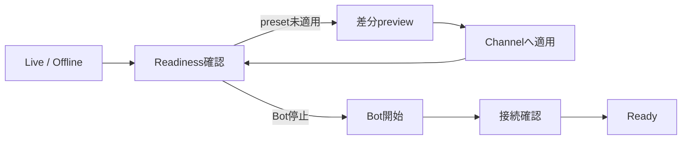
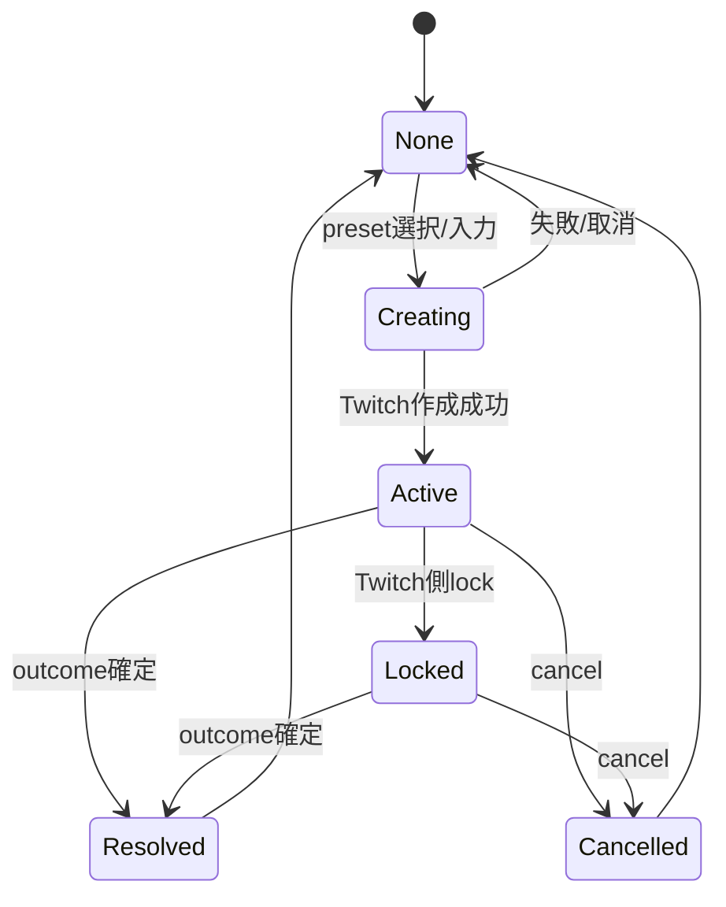
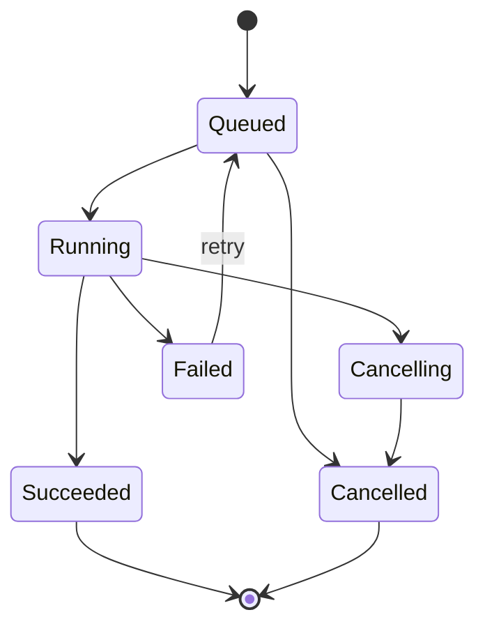

# 02. 情報設計と UI 設計

2026-09-06更新: 画面の基本構成は[07のAccepted](07-recording-and-workflows.md)と
[09のAccepted](09-automation-commands-and-predictions.md)を反映する。
設定・復元は[08](08-nas-backup-and-settings.md)、数値・欠測表示は[10](10-viewer-metrics-and-data-quality.md)を参照する。
以下の旧ワイヤーフレームは要素の参考であり、配置や名称に違いがある場合は今回の合意した画面案を優先する。
記載する経路は将来案。現行のv2パイロットは `/v2/live` と読み取りAPIであり、全経路が実装済みではない。

## 1. Design direction: Calm Control Room

配信中に常時開く道具として、ゲーム風の装飾よりも「落ち着いた運用コンソール」を
目指す。Twitch purple は action と live identity に限定し、正常状態を大量の緑、
異常状態を大量の赤で塗り分けない。情報の優先度、見出し、余白、明示ラベルで判断できる
UI にする。

### 目指す印象

- quiet / focused / trustworthy
- 日本語を主とした短い operation copy
- dark と light の両方で同じ情報階層
- 数値カードを並べる dashboard ではなく、現在状態から次の行動へつながる console

### 避けるもの

- 絵文字だけの action、色だけの status、hover しないと分からない control
- すべてを card で囲う layout
- 設定 edit を dashboard modal へ積み上げる構造
- 同じ prediction component の複数描画
- 表示のたびに Twitch API response を待つ画面
- desktop layout を縮小しただけの mobile UI

## 2. 第一階層の情報設計

```text
ライブ              現在の配信、視聴者、同接、イベント、セット適用、マーカー
配信履歴            平均・最大同接、推移、比較、イベント、VODへの参照
コミュニティ        視聴者、フォロワー履歴、人物メモ、参加履歴
配信セット          タイトル・カテゴリー・タグの準備と適用
自動化              自動投稿、チャットコマンド、予想プリセット
設定                Twitch接続、記録・機能、保存・削除、バックアップ、復元
```

Desktop は左sidebar。狭い画面は名称を残した上部の折り返しナビゲーションへ切り替える。
視聴者一覧・グラフ等は幅に応じて縦に並べ、単に縮小して文字を読めなくしない。
独立したアーカイブ管理は維持し、配信履歴と設定の補助導線から開けるようにする。

### Global app shell

```text
┌────────────────────────────────────────────────────────────────────┐
│ Channel name   LIVE 01:24:36 · Twitch connected     Alerts  Profile│
├──────────────┬─────────────────────────────────────────────────────┤
│ Live         │ Page title                       Context actions     │
│ Automation   │                                                     │
│ Community    │ Main content                                        │
│ Insights     │                                                     │
│ Archive      │                                                     │
│ Settings     │                                                     │
└──────────────┴─────────────────────────────────────────────────────┘
```

Global header に表示するのは、全画面で判断価値があるものだけとする。

- 実 live/offline と経過時間。
- Twitch connection の `connected / reconnecting / action required`。
- 未確認の warning/error 件数。
- channel identity。

viewer count、game、VOD progress のような局所情報は各ページに置く。

## 3. Route map

| Route | 目的 | Primary action |
|---|---|---|
| `/live` | 現在の配信を準備・監視・操作 | 状況依存: preset 適用 / Bot 開始 / prediction |
| `/presets` | 配信セットを独立画面で管理 | 作成・編集・差分確認 |
| `/automation/rules` | 自動チャットを管理 | 新しい rule |
| `/automation/commands` | チャットコマンドを管理 | 作成・応答プレビュー |
| `/automation/predictions` | 予想プリセットと未確定の予想を管理 | 内容確認・開始・確定 |
| `/community/session` | 現セッション視聴者を扱う | viewer 検索 |
| `/community/viewers` | 累積 viewer record を扱う | filter / export |
| `/community/followers` | follower sync と履歴 | 同期 |
| `/insights` | 配信を検索・比較する | 比較対象を選択 |
| `/insights/streams/<id>` | 一配信を分析する | VOD を開く |
| `/insights/compare` | 2配信の同接とイベントを比較 | 対象・時間範囲の切替 |
| `/archive` | VOD と job を管理する | 履歴同期 |
| `/settings/connections` | Twitch credentials/scopes | 接続確認 |
| `/settings/bot` | Bot と chat 動作 | 設定保存 |
| `/settings/data` | retention/export/import 状態 | export |
| `/settings/backups` | NAS保存状態・スケジュール・容量 | 保存設定・手動実行 |
| `/settings/restore` | 検証済みコピーから復元 | 候補検証・対象確認 |
| `/settings/system` | version、health、診断 | 診断を取得 |

`/` は `/live` へ redirect する。URL は reload、bookmark、back/forward で意味を保つ。
初回実装では server-rendered page navigation を使い、SPA router を導入しない。

## 4. 現行機能からの移動

| 現行 surface | v2 の置き場所 | 変更理由 |
|---|---|---|
| top bar live/game/viewers | Global + `/live` | global と局所 status を分離 |
| viewers card | `/live` compact roster + `/community` full view | 配信中確認と管理を分離 |
| presets tab/modal | `/presets`、`/live` quick apply | 独立した配信セット画面とライブ中の利用 |
| rules tab/monitor | `/automation/rules`、`/live` health summary | edit と運用監視を分離 |
| prediction tab/modal | `/live` と `/automation/predictions` の共通コンポーネント | 同じ予想ID・状態を参照し、配信外でも未確定分を管理 |
| events/logs card | `/live/activity` timeline | event と system log を区別 |
| settings modal | `/settings/*` | 深い form を安定 URL へ移動 |
| analytics list/calendar/trends | `/insights` view switch | 同一 query model で表示切替 |
| analytics detail | `/insights/streams/<id>` | stream entity を中心にする |
| VOD actions in analytics | `/archive` + stream detail link | media job と分析を分離 |
| layout B/monitor toggle | `/live` focus mode | 意味のある一時表示へ変更 |

## 5. `/live` 画面

同じ route で状態に応じて優先 content を変える。
上部は配信状態・セット適用・マーカー操作、主領域は視聴者一覧と同接推移・イベントを並べる。
平均・最大には記録範囲と更新時刻を付け、更新で人物の選択や操作位置を移動しない。

### 5.1 未設定

- 「Twitch に接続する」を一つの primary action とする。
- client ID、token 等を live page に直接並べず、guided setup へ移動する。
- 既存 history がある場合も閲覧可能にする。

### 5.2 Offline / ready

```text
┌─ Stream readiness ─────────────────────┬─ Quick setup ────────────┐
│ OFFLINE                                │ Preset: FFXIV 通常枠     │
│ Twitch connected · Bot ready           │ [差分を見る] [適用]      │
│ Last checked 12 sec ago                │                          │
│                                        │ Bot [Start]              │
├─ Recent session ───────────────────────┴──────────────────────────┤
│ Last stream summary · pending VOD · open insights                │
└──────────────────────────────────────────────────────────────────┘
```

Readiness checks:

- Twitch token と必要 scope。
- EventSub/chat connection。
- Bot enabled state。
- 適用中 title/category/tags。
- selected game に該当する rule 数。
- VOD auto setting（off を warning にしない）。

### 5.3 Live

```text
┌─ LIVE · 01:24:36 ──────────────────────┬─ Live actions ───────────┐
│ Title                                  │ Prediction               │
│ Category · viewers · comments/min      │ Shoutout                 │
│ Observed 4 sec ago                     │ X 告知文 / Focus mode    │
├─ Activity ─────────────────────────────┼─ Session viewers ────────┤
│ Filter: Important / All / System       │ Search                    │
│ timestamp · event · result             │ viewer · visit · actions │
├────────────────────────────────────────┴──────────────────────────┤
│ Automation health · 3 active · next action 02:14 · [details]     │
└──────────────────────────────────────────────────────────────────┘
```

Live action は active prediction の有無で変える。開始済みなら「予想を開始」ではなく、
残り時間、outcomes、resolve/cancel を表示する。Shoutout は recent raid と viewer search から
対象を選べるが、対象 ID と login を確認してから送る。

### 5.4 Degraded

過去値を空や 0 に置換しない。

```text
Twitch に再接続しています
最後に確認できた live 状態: LIVE（42秒前）
影響: viewer count と新着イベントを更新できません
自動再試行: 8秒後     [今すぐ再試行] [詳細]
```

状態は `stale` を伴う last-known data として表示し、操作できない action は disabled reason を
直下に出す。tooltip だけに理由を置かない。

## 6. Automation

### Presets

- 一覧は name、game、title preview、tag count、social tags、last used を表示する。
- 適用は row action。編集は dedicated page または side sheet を使う。
- 適用 confirmation は old/new diff を示し、同値なら API を呼ばない。
- game search は typeahead だが、入力と API failure を分離する。
- `/live` の「X 告知文を開く」は適用中 preset の social tags と cached channel state から text を
  preview し、明示 click で X intent を新しい tab に開く。自動投稿成功のように表示しない。

### Rules

- rule は stable ID、name、game scope、message、interval、minimum comments、enabled を持つ。
- default 表示は game group ごと。search と `enabled / paused / invalid` filter を持つ。
- drag-and-drop だけに依存せず、keyboard 対応の「前へ/後へ」を提供する。
- edit draft は server validation error で失われない。
- live status は「次回送信」ではなく「次回評価」と「待機理由」を区別する。

### Commands and predictions

自動化画面は[09](09-automation-commands-and-predictions.md)の3タブと、編集・送信しないテストを使う。
保存だけでは外部操作を行わず、初期は3機能ともオフ。予想の受付終了・確定・取消を別操作にする。
機能オフや配信終了で未確定の予想を隠さない。全体停止時は最後の状態と確認時刻を示す。

## 7. Community

### Session view

- current session と cumulative record を一 row で混ぜず、列 group を分ける。
- viewer name、滞在時間、訪問回数、follow/sub status、memo indicator を基本列にする。
- row activate で viewer detail drawer。shoutout は drawer 内の明示 action。

### Viewer detail

```text
Display name / login
Current: joined 1h 12m · follower · subscriber
Lifetime: 24 visits · 38h watched · 540 comments
Notes: editable text
Recent streams: list
Actions: Shoutout
```

表示名は可変、Twitch user ID を identity とする。存在しない/ban 済み viewer の履歴も
消さず、status を添える。
ワイヤーフレームの `watched` は実視聴時間を意味しない。UIではチャット接続による観測時間として表示する。
未確認と未フォロー、参加記録なしと0回を区別し、人物を切り替えてもメモの下書きを保持する。

## 8. Insights

### List

- default は最新順の compact table。calendar は同じ filter/query の view switch。
- search、date range、game、source、VOD state を server-side filter にする。
- sortable header は `<button>` を含み、sort direction を読み上げる。
- row 全体 click にせず、stream title を detail link にする。

### Stream detail

上から順に次を置く。

1. title、date、duration、game、data completeness。
2. viewers と comments/min の同期 chart。
3. event timeline。
4. audience/emote summary。
5. chat log（保持設定で存在する場合）。
6. VOD link/status。

同接グラフにイベント・マーカーを同じ時間軸で重ね、選択で関連記録を開く。
平均・最大・カバー率は[10の計算契約](10-viewer-metrics-and-data-quality.md)で表示する。
比較は同じカテゴリーの前回を候補に、任意の配信へ切替可能。全体値と同じ経過時間範囲の値を区別する。

Bot 非稼働配信では「データなし」ではなく、Twitch API 由来 metadata と Bot 観測値の
どちらが存在するかを示す。Chart は summary と accessible data table を併設する。

## 9. Archive

一つの row に remote VOD、download job、local file の 3 状態を混ぜない。

| Column group | 内容 |
|---|---|
| Stream | date、title、duration |
| Twitch VOD | available / expired / unknown |
| Job | queued / running / failed / complete、progress、speed |
| Local asset | exists、size、relative path |
| Actions | download / cancel / retry / delete |

- Bulk download は対象件数と推定される操作範囲を確認する。
- Cancel と delete を別 action にする。
- Delete dialog は stream title、file、history への影響を明記する。
- Progress polling は visible/running job のみを対象にし、完了後も result を保持する。

## 10. Settings

主な5項目はTwitch接続、記録・機能、保存・削除、バックアップ、復元。
[08](08-nas-backup-and-settings.md)の休止・容量・復元の状態を表示し、診断情報とアーカイブ管理は補助導線に置く。

### Connections

- Broadcaster account と Bot account を別の connection row とし、同一 identity の場合だけ
  「Broadcaster と共有」と表示する。
- token 値を再表示しない。「設定済み」「更新が必要」「subject 不一致」「不足 scope」を表示する。
- actor/feature-to-scope matrix を表示する。
- 接続確認は Twitch API、EventSub、chat send permission を別結果にする。

### Bot

- Bot enabled、welcome message、ignore filters、rule evaluation のような動作設定。
- debug action は production settings と区切り、意図と影響を表示する。

### Data

- history/chat retention、export、migration report、database health。
- `/app/data` と `/app/downloads` の free space は取得できる場合のみ表示する。

### System

- app version、schema version、runtime start time、worker health。
- secret を除外した診断 bundle を作れるようにする（後続 scope）。

## 11. Component model

再利用単位は visual card ではなく、意味と挙動で決める。

| Component | 責務 |
|---|---|
| `StatusIndicator` | label + state + last updated。色だけに依存しない |
| `Freshness` | observed time と stale threshold |
| `ActionButton` | idle/submitting/succeeded/failed、二重送信防止 |
| `ProblemBanner` | 影響、原因、回復 action、detail ID |
| `ActivityTimeline` | domain event と operation result の統一表示 |
| `DataTable` | accessible sort/filter/pagination/empty state |
| `DialogForm` | focus trap、Escape、return focus、server validation |
| `JobProgress` | phase、percent、speed、cancel state、result |
| `MetricFigure` | unit、period、missing data、chart/table alternative |

## 12. Interaction rules

### Feedback

- local state change: 同じ領域内に即時反映。
- remote command: button 内 progress + operation result。
- background completion: activity timeline と toast。toast だけで結果を失わない。
- failure: 人が読める概要 + retry + copyable reference ID。token や raw response は表示しない。

### Confirmation

Confirmation が必要:

- prediction resolve/cancel。
- 記録・自動処理を止めるBot全体停止。公開状態の消去と停止期間の欠測を説明する。
- VOD file delete、bulk download。
- history/data delete。
- credentials 置換。

通常は不要:

- filter/sort、memo save、rule enable、Bot start、preset draft save。

Twitch への不可逆または公に見える action は、action label と対象を明示する。

### Loading and empty states

- skeleton は初回 read のみ。継続更新は current content を保って freshness を変える。
- empty、filtered empty、not collected、permission denied、load failed を別 copy にする。
- infinite spinner を使わず、timeout と retry を用意する。

## 13. Responsive design

| Width | Navigation | Layout | Table strategy |
|---|---|---|---|
| `>= 1200px` | full sidebar | 2-column context layout | full columns |
| `768–1199px` | compact sidebar | priority-based 1–2 columns | low priority columns hide via chooser |
| `320–767px` | top bar + drawer | single column | key rows + detail view、必要時のみ横 scroll |

- touch target は少なくとも 44 × 44 CSS px。
- live actions は画面下部へ fixed にせず、document flow 内で近接配置する。
- mobile では full analytics chart を縮小せず、summary と横方向 time window を切り替える。
- modal form は small screen で dedicated full-page route と同じ構造を使う。

## 14. Accessibility acceptance

- skip link、landmark、ページごとの一意な `h1`。
- active navigation は `aria-current="page"`。
- tab を使う場合は tablist/tab/tabpanel と矢印 key を実装する。単なる route subnav を優先する。
- dialog は native `<dialog>` を基本とし、open/close 後の focus を検証する。
- table sort は button + `aria-sort`。
- live update は重要度別に `polite`、重大な切断だけ `alert`。
- chart は title/description と同値 data table を持つ。
- 200% zoom、320 CSS px、prefers-reduced-motion、forced colors を確認する。

## 15. Visual tokens

実装値は UI prototype と contrast test で確定する。

```text
Color roles: canvas / surface / raised / text / muted / border
             action / action-hover / live / success / warning / danger
Typography:  system Japanese sans, tabular numerals for metrics/time
Spacing:     4px base, common steps 8 / 12 / 16 / 24 / 32
Radius:      controls 6–8px, surfaces 8–12px; status を pill 乱用しない
Elevation:   dialog/popover のみに限定
Motion:      120–180ms state transition、loop animation なし
```

Light/dark は semantic token を共有し、Twitch purple の literal 値を component 内に
直接書かない。success/danger は文字、icon、shape と併用する。

## 16. 主要フロー

### 配信準備



### Prediction



### VOD job



## 17. UI 実装完了条件

- 現行機能 mapping に orphan がない。
- 未設定、offline、live、reconnecting、scope 不足、429、server error、empty、partial data を
  prototype と browser test で確認済み。
- desktop/tablet/mobile で primary task の順序が同じ。
- keyboard、screen reader semantics、contrast、zoom の Critical/High issue がない。
- page load 時の Twitch API 待ちを排除し、server snapshot で initial view を描画できる。
