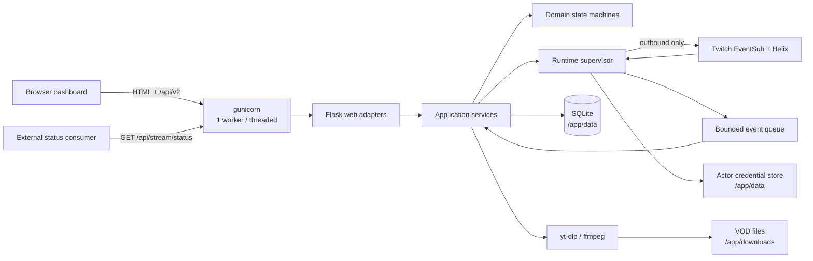
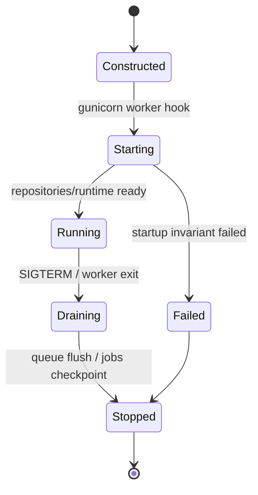
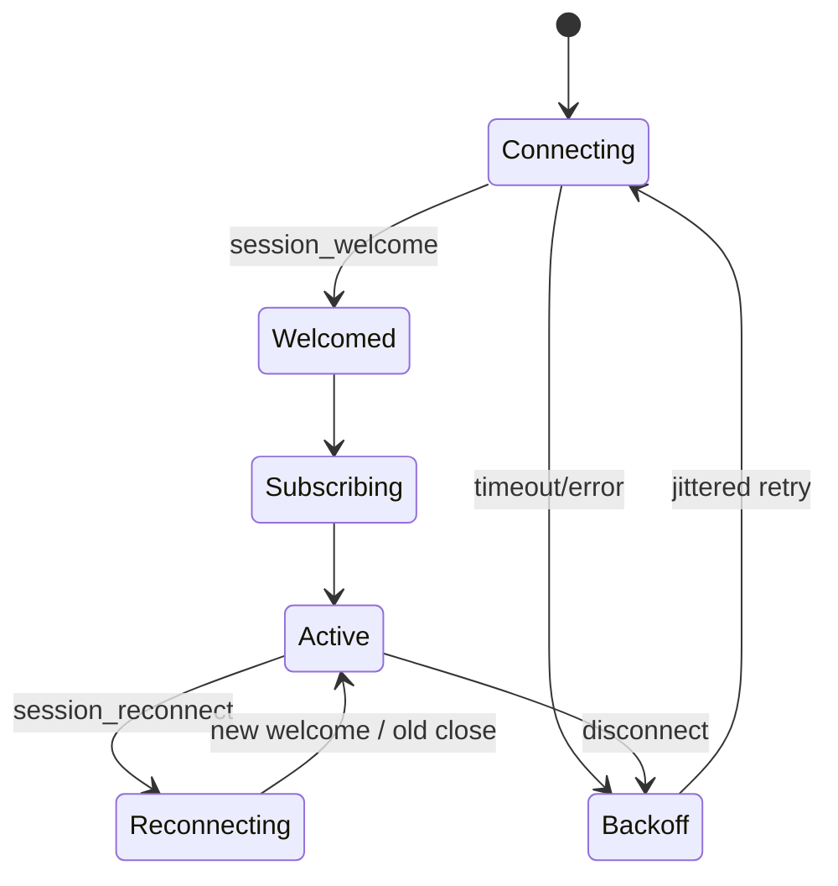
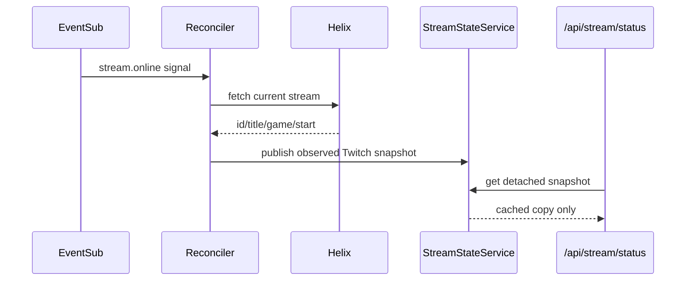

# 03. システムアーキテクチャ

2026-09-06補足: 計画中の構成と現行v2基盤の実装状況は[11](11-implementation-contract-and-delivery.md)で区別する。
同接の取得・保存・記録境界は[10](10-viewer-metrics-and-data-quality.md)を参照し、
minute aggregatorだけで新しい同接観測を置き換えない。既存のスナップショット・停止・配備境界を維持する。

## 1. Architecture decision

**Status: Recommended**

v2 は Python 3.12 / Flask を使う modular monolith とし、単一 Docker container・
gunicorn 1 worker + threads を維持する。内部は domain、use case、adapter、web、runtime に
分離し、Twitch・disk・clock・process lifecycle を明示的な境界にする。

運用規模に対して microservice、Redis、外部 database、SPA runtime は不要である。
一方で、現在の「route と global state と worker が同じ module に触れる」構造は継承しない。

## 2. 技術選択

| 項目 | 推奨 | 理由 |
|---|---|---|
| HTTP server | Flask 3 + gunicorn | 現行運用を維持し、migration risk を抑える |
| HTML | Jinja2 page shell | 初期表示、URL、accessibility、no-JS failure を単純化 |
| Browser code | Vanilla JS ES modules | Node runtime と SPA state manager を不要にする |
| CSS | project-local semantic CSS | UI を一から作り、外部 CDN と framework lock-in を避ける |
| Database | standard-library SQLite | transaction、query、migration を追加依存なしで得る |
| HTTP client | shared `requests.Session` adapter | timeout、retry、rate limit、logging を中央化 |
| Twitch inbound | EventSub WebSocket | Twitch 推奨の chat/event transport |
| Chat outbound | Helix Send Chat Message | 新規 chatbot の公式経路に合わせる |
| VOD | yt-dlp + ffmpeg adapter | 現行 feature と media boundary を維持 |
| UI updates | aggregate snapshot polling | gunicorn thread を長時間占有せず、復旧が簡単 |

EventSub WebSocket client library は、同期 thread API、再接続制御、arm64 wheel 不要の条件で
短い spike 後に一つだけ追加する。採用候補を複数同時に依存へ入れない。

## 3. 選ばない構成

### React/Vue SPA

高度な client-side editing が主目的ではなく、単一利用者の operation console である。
API と page state を二重管理し、Node build、hydration、router、large bundle を導入する利益が
現時点では小さい。将来も API contract を保てば段階導入は可能である。

### FastAPI への同時移行

framework migration と domain/storage/UI rebuild を同時に行うと、問題の切り分けと
behavior parity が難しい。型付き request/response と OpenAPI は Flask 上でも実現できる。

### Redis/Celery/別 worker container

現行の単一 container・Portainer 運用を壊し、永続化・health・deployment の境界が増える。
VOD job を含む現在の負荷には in-process supervisor と SQLite job state で十分である。

### JSON を主 database として継続

単純な export/import には適するが、viewer/event/history/job の複数 entity を安全に更新し、
filter/pagination/migration する用途には不向きである。JSON は migration input と export format に
限定する。

## 4. Target topology



外部 status endpoint は `Application services` の cached `PublicStreamSnapshot` を読むだけで、
Twitch adapter や job system に到達できない dependency direction とする。

## 5. Source layout

```text
src/twitchbot/
  __init__.py
  web/
    app.py                 # create_app(container, runtime_handle)
    pages/                 # Jinja page routes
    api/                   # /api/v2 route adapters
    compatibility/         # /api/stream/status 等
    errors.py              # problem response mapping
  application/
    commands/              # mutation use cases
    queries/               # read models / snapshots
    dto.py
  domain/
    stream.py
    automation.py
    community.py
    prediction.py
    archive.py
    events.py
  adapters/
    twitch/
      helix.py
      eventsub.py
      auth.py
      rate_limit.py
    persistence/
      sqlite.py
      repositories.py
      migrations/
    media/
      downloader.py
      files.py
    clock.py
  runtime/
    supervisor.py
    scheduler.py
    event_processor.py
    health.py
  templates/
  static/
    css/
    js/
    vendor/
tests/
  unit/
  contract/
  integration/
  browser/
```

`domain` は Flask、requests、sqlite、thread、filesystem を import しない。`application` は
protocol/interface 越しに adapter を使い、route は input/output translation だけを担う。
依存注入 framework は使わず、startup 時に小さな `Container` を手で組み立てる。

## 6. Runtime lifecycle

### 現行から変える点

現行 `app.py` は module import に伴って worker を開始する。v2 の `create_app()` は side effect を
持たず、test や migration command が Twitch connection を開始しない構造にする。

### Target lifecycle



- gunicorn worker startup hook が `RuntimeSupervisor.start()` を 1 回だけ呼ぶ。
- worker exit hook と `atexit` fallback が idempotent な `stop()` を呼ぶ。
- Docker は 1 gunicorn worker を固定し、threads で HTTP と background workers を動かす。
- application factory を import する unit test、CLI、migration は runtime を開始しない。
- supervisor は child thread の last heartbeat、last success、last error を保持する。

### Managed workers

| Worker | 責務 | 永続 checkpoint |
|---|---|---|
| EventSub receiver | connection/session/subscription、raw notification enqueue | session health、subscription status |
| Event processor | validation、dedupe、domain event 適用 | processed message ID、events、read models |
| Reconciler | Helix で stream/channel/chat/follower 状態を定期照合 | public snapshot、channel read model、stream session |
| Automation scheduler | rule 条件評価と chat command | rule last evaluation/execution |
| Archive worker | VOD job 実行、cancel、recovery | job phase/progress/result |
| Metrics flusher | minute aggregate の transaction write | stream samples |

各 worker は共有 `shutdown_event`、bounded wait、fake clock 可能な loop を使う。裸の
`while True`、長時間 sleep、unbounded queue、floating thread を作らない。

## 7. State ownership

| State | Owner | Storage | Reader |
|---|---|---|---|
| Public current stream | `StreamStateService` | lock-protected memory | status API / live query |
| Current session viewers | `SessionAudienceService` | lock-protected memory + periodic DB | live/community query |
| EventSub session | `EventSubWorker` | memory | health query |
| Actor tokens and scopes | `CredentialRegistry` + actor別 `TokenManager` | credential store + memory | Twitch adapters/health |
| Rule runtime state | `AutomationScheduler` | SQLite | automation query |
| Minute counters | `MetricsAccumulator` | lock-protected memory | flusher/live query |
| VOD jobs | `ArchiveService` | SQLite | worker/archive query |
| Operation activity | `OperationLog` | SQLite bounded retention | UI/system diagnostics |

Memory object を route が直接 mutate しない。snapshot query は immutable DTO/copy を返し、
mutation は command queue または application service を経由する。

## 8. Twitch integration

### 8.1 Recommended transport

新しい受信経路は EventSub WebSocket、送信は Helix API とする。Twitch は新規 chatbot に
EventSub `channel.chat.message` と Send Chat Message API を案内しており、IRC は機能が限定された
互換経路として位置付ける。

この project は end-user system 上で動くため WebSocket + User Access Token を採る。ただし現行は
Bot user ID と broadcaster ID、および Bot/Broadcaster token を別に持てる。v2 は account を一つと
仮定せず、distinct actor ごとに credential と必要な EventSub session/subscription set を管理する。
同じ user ID なら一 record/session へ安全に集約できる。

公式根拠:

- [Chat & Chatbots](https://dev.twitch.tv/docs/chat/)
- [Authenticating and Setting up EventSub](https://dev.twitch.tv/docs/chat/authenticating/)
- [IRC migration](https://dev.twitch.tv/docs/chat/irc-migration/)
- [Sending and Receiving Chat Messages](https://dev.twitch.tv/docs/chat/send-receive-messages/)

### 8.2 Subscription groups

実装時に current Twitch subscription versions と条件を再確認し、feature ごとに購読する。

| Group | 用途 |
|---|---|
| Stream online/offline | immediate live transition signal |
| Channel chat message | chat count、viewer activity、emote/badge sample |
| Follow/subscription/gift/bits/raid | activity と analytics |
| Channel Points redemption | redemption event/analytics |
| Prediction lifecycle | active prediction reconciliation |
| Shoutout lifecycle | command result/received event visibility |

各購読は `desired subscription` として定義し、session welcome 後に必要分を作成する。
不足 scope の購読だけを `unavailable` とし、他の feature を停止させない。

### 8.3 WebSocket state machine



Twitch の WebSocket contract に従う。

- welcome 後、既定 10 秒以内（Twitch が別値を示す場合はその期限内）に少なくとも一つの
  subscription を作成する。keepalive timeout と subscription deadline を混同しない。
- `session_reconnect` では新 connection が welcome するまで旧 connection を維持する。
- 通常 disconnect 後は subscription が失われる前提で再作成する。
- Twitch は lost event の replay を保証しないため、定期 reconciler を残す。
- notification は at-least-once と扱い、`message_id` で重複排除する。
- receiver は parse/verify/enqueue だけを行い、DB write や Helix call で block しない。

公式根拠: [Handling WebSocket Events](https://dev.twitch.tv/docs/eventsub/handling-websocket-events)、
[EventSub](https://dev.twitch.tv/docs/eventsub/)。

### 8.4 Reconciliation and public stream state

EventSub は即時 signal、Helix stream lookup は実状態の照合と metadata enrichment に使う。



- Bot disabled は external snapshot を即時 clear する。
- accepted `stream.offline` は clear し、missed event は定期 poll の連続 offline 確認で補う。
- debug/ignore mode は automation test state だけを変え、public state writer を呼ばない。
- public API request から reconciler を起動したり Helix を呼んだりしない。

### 8.5 Authentication and actor routing

Authorization Code user token と refresh token を前提にし、credential を Twitch actor に bind する。

| Actor | Expected subject | Main responsibilities |
|---|---|---|
| `bot` | configured `bot_user_id` | chat EventSub、chat send、chatters（必要な moderator status を含む） |
| `broadcaster` | configured `broadcaster_id` | channel update、prediction、followers、channel events、VOD metadata |

Shoutout は初期実装では broadcaster actor を使う。将来 moderator actor を追加する場合も、
`moderator_id` と token subject の一致を新しい明示 actor として扱い、Bot/Broadcaster token へ
暗黙 fallback しない。

`CredentialRegistry` は role → credential reference を保持する。同じ Twitch user が bot と
broadcaster を兼ねる場合、二つの role が同じ record を参照できる。異なる場合は access token、
refresh token、expiry、granted scopes、refresh lock を完全に分離する。

各 actor の `TokenManager` は:

- OAuth validate response の subject user ID と expected subject を startup、保存、refresh 後に確認する。
- token、expiry、granted scopes を actor ごとに保持する。
- 401 を受けたとき、その actor について一つの refresh だけを実行する single-flight lock を持つ。
- refresh response で同じ actor の access token と refresh token を同一 transaction 相当で更新する。
- token value を log、metric、error payload に含めない。
- operation ごとに actor、必要 scope、不足 scope を返す。

`CredentialRouter` は operation → actor を固定 table で解決する。caller が任意 token や user ID を
渡せる API にしない。EventSub WebSocket は User Access Token 専用であるため、distinct actor の
subscription が必要なら actor ごとに session を持つ。最初の Twitch spike で subscription ごとの
actor/condition/token requirements を公式 current version と照合し、session 数を最小化する。

Twitch は 401 後の reactive refresh を案内し、refresh token が更新され得るため保存更新が
必要である。詳細は [Refreshing Access Tokens](https://dev.twitch.tv/docs/authentication/refresh-tokens/)
に従う。

### 8.6 Feature scope baseline

| Actor | Feature | Scope baseline |
|---|---|---|
| Bot | Chat receive | `user:read:chat` |
| Bot | Chat send | `user:write:chat` |
| Bot | Chatters | `moderator:read:chatters` + moderator/broadcaster condition |
| Broadcaster | Channel update | `channel:manage:broadcast` |
| Broadcaster | Prediction manage | `channel:manage:predictions` |
| Broadcaster | Channel Points read | `channel:read:redemptions` |
| Broadcaster | Follower read/EventSub | `moderator:read:followers` where required |
| Broadcaster | Shoutout | `moderator:manage:shoutouts` |

App Access Token を使う cloud-bot/badge model では `user:bot` と `channel:bot` が追加で関係する。
初期 target の local WebSocket/User Access Token model へ無条件に要求せず、将来 transport/identity を
変える場合の別 decision とする。

Subscription type、Bot/broadcaster/moderator ID 条件、scope は実装時に Twitch の
[Scopes](https://dev.twitch.tv/docs/authentication/scopes/) と
[API reference](https://dev.twitch.tv/docs/api/reference) で再検証する。

### 8.7 Rate limits and retry

すべての Helix call は一つの adapter を通す。

- `Ratelimit-Limit/Remaining/Reset` を read し、health/read model に反映する。
- 429 は reset 時刻まで待ち、UI command に retry timing を返す。
- timeout、connection error、502/503/504 のみ bounded retry + jitter を許可する。
- 400/401/403/404 は無条件 retry しない。
- chat send は channel ごとの最小間隔を scheduler で守る。
- operation ID/idempotency guard で button 再送による二重 command を防ぐ。

公式根拠: [Twitch API guide](https://dev.twitch.tv/docs/api/guide/)。

## 9. Application patterns

### Commands and queries

- Query は DB/snapshot だけを読み、Twitch を呼ばない。
- Command は validation → authorization/scope check → adapter call → local commit → result の順。
- 長時間 command（VOD）は job を作って `202 Accepted` を返す。
- Twitch で成功し local commit に失敗した場合、operation log に `reconciliation_required` を残す。

### Domain events

内部 event は transport payload を直接流用せず、versioned normal form に変換する。

```text
ChatMessageObserved
StreamObservedLive / StreamObservedOffline
ViewerSeen
ChannelEventObserved
PredictionChanged
AutomationEvaluated / ChatMessageSent
ArchiveJobChanged
OperationFailed
```

同じ event を analytics、live activity、viewer aggregation が利用できる。Twitch payload 全体を
恒久保存せず、必要 field だけを normal form にする。

### Time and identity

- 永続時刻は timezone-aware UTC ISO 8601 または Unix milliseconds に統一する。
- UI で JST に変換する。
- elapsed/interval は monotonic clock を使う。
- Twitch user、stream、prediction、event は platform ID を identity とする。

## 10. Frontend architecture

各 page は server-rendered shell と page-specific ES module を持つ。

```text
static/js/
  core/http.js            fetch、CSRF、problem parsing、timeout
  core/poller.js          visibility aware polling、backoff
  core/dom.js             safe DOM construction
  components/dialog.js
  components/toast.js
  components/data-table.js
  pages/live.js
  pages/automation-rules.js
  pages/community.js
  pages/insights.js
  pages/archive.js
```

- inline handler、inline script、unsafe HTML interpolation を使わない。
- `textContent` と template clone を基本にし、server data は JSON script element で渡す。
- page ごとに必要 module と chart asset だけを load する。
- polling は `document.visibilityState` で減速し、失敗時 exponential backoff を使う。
- live aggregate は live 中 2–3 秒、offline 10–15 秒を初期値とし、実機測定で調整する。
- mutation 後は endpoint result で局所更新し、全 page reload を必須にしない。
- X 告知文は cached channel read model と preset social tags から browser 内で生成し、利用者 click で
  intent URL を開く。server-side X call、X credential、自動投稿を作らない。

## 11. Failure isolation

| Failure | 影響させない領域 | Recovery |
|---|---|---|
| EventSub disconnect | history/VOD/UI static reads | reconnect + Helix reconcile |
| Helix 429 | cached status/history | reset-aware delayed command |
| Expired token | local data/Archive file view | single refresh、action required |
| SQLite busy | Twitch receiver thread | bounded queue + short transaction retry |
| malformed event | other events | quarantine metadata + continue |
| yt-dlp failure | Bot/chat/live state | job failed + retry |
| ffmpeg missing | non-media features | archive health warning |
| one worker crash | supervisor siblings | health degraded、bounded restart policy |

## 12. Health model

`/health/live` は process が response 可能かだけを返す。`/health/ready` は DB schema、writable
mount、runtime startup を確認するが、Twitch が一時的に offline でも container を再起動させない。

UI 用 health query は component ごとに次を返す。

```text
component: eventsub | helix | token | automation | archive | database
state: healthy | degraded | stopped | action_required
last_success_at
last_error_at
message_code
retry_at
```

Docker HEALTHCHECK は lightweight liveness endpoint を使い、dashboard `/` や Twitch API に
依存させない。

## 13. Architecture acceptance

- app factory の import で thread、network、filesystem mutation が始まらない。
- production runtime は一度だけ start/stop し、全 child worker が join 可能。
- route/query test から real DNS/Twitch/media process へ到達できない。
- public stream API の call graph に Twitch adapter が存在しない。
- EventSub duplicate/reconnect/lost-event reconciliation を deterministic test で再現できる。
- SQLite transaction 中に network、yt-dlp、ffmpeg を呼ばない。
- worker failure が VOD/chat/history 全体へ連鎖しない。
- `linux/arm64` image で全 production dependency を install/import できる。
