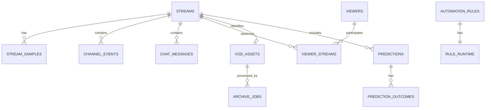

# 04. データと API 設計

2026-09-06補足: 本文は将来設計を含む。現在のmigrationで存在する範囲と追加する論理モデル・APIは
[11](11-implementation-contract-and-delivery.md)、同接の計算と指標別の記録品質は
[10](10-viewer-metrics-and-data-quality.md)を参照する。計画中のテーブルを実装済みと扱わない。

## 1. Data decision

**Status: Recommended**

- 運用データ: `/app/data/twitchbot-v2.sqlite3`
- 非秘密設定: SQLite の versioned settings
- 秘密情報: actor-bound `/app/data/credentials.json` または Docker secret/environment
- 現行 JSON/JSONL: read-only migration source と rollback source
- VOD media: `/app/downloads` のまま
- 現在配信・現在セッション・minute accumulator: process memory + lock-protected snapshot

既存の追跡外 `data.db` は使用、参照、変更しない。新 database は名前と schema を明示して
区別する。

## 2. なぜ SQLite か

現行 JSON は単一 document の read-modify-write で、process-local lock、部分破損、複数 entity の
整合性、検索、pagination に課題がある。SQLite は Python 標準 library で、Raspberry Pi の
単一 process 運用に適し、transaction、index、foreign key、online backup を提供する。

運用条件:

- DB は local `/app/data` mount に置き、NAS 上の `/app/downloads` へ置かない。
- `PRAGMA foreign_keys=ON`、busy timeout、WAL を起動時に確認する。
- connection は thread 間で共有せず、request/worker 単位で取得する。
- transaction を短くし、network call や media process を transaction 内で実行しない。
- schema migration は連番、forward-only、transactional とする。
- backup は `sqlite3` backup API を使い、稼働中の DB file を単純 copy しない。

## 3. 保存境界

```mermaid
flowchart TB
    M[Memory snapshots]
    DB[(twitchbot-v2.sqlite3)]
    C[credentials.json / Docker secret]
    D[/app/downloads]
    L[Legacy JSON / JSONL]

    M -->|minute/session flush| DB
    DB -->|read models| M
    C -->|CredentialRegistry / actor TokenManagers only| M
    DB -->|relative asset metadata| D
    L -->|one-way verified import| DB
```

| Data | 保存先 | Rule |
|---|---|---|
| actor別 access/refresh token、client secret | credentials | subject ID を bind し API/HTML/export/log へ返さない |
| channel ID、UI setting、feature flag | settings table | typed key + explicit default |
| current public stream | memory | detached copy、end/disabled で clear |
| current session viewers | memory + periodic DB | detached nested copy |
| streams、samples、events、viewers | SQLite | UTC、platform ID identity |
| operation/audit result | SQLite | bounded retention、secret redaction |
| VOD bytes | `/app/downloads` | validated relative path only |
| VOD job metadata | SQLite | restart recovery state machine |

## 4. Logical data model



### 4.1 Core/system

#### `schema_migrations`

| Field | Type | Notes |
|---|---|---|
| `version` | integer PK | monotonically increasing |
| `name` | text | human-readable migration |
| `applied_at` | UTC timestamp | audit |
| `checksum` | text | changed migration detection |

#### `settings`

| Field | Type | Notes |
|---|---|---|
| `key` | text PK | allowlisted typed key |
| `value_json` | text | schema-validated JSON |
| `revision` | integer | optimistic concurrency |
| `updated_at` | UTC timestamp | audit |

初期値を code schema にすべて列挙する。少なくとも Bot enabled、welcome、filters、poll/flush
interval、`enable_vod_download=false` を暗黙の missing-key behavior にしない。

#### `channel_read_model`

Singleton per configured channel。`channel_id`, `title`, `game_id`, `game_name`, `tags_json`,
`active_preset_id`, `observed_at`, `source`, `revision` を持つ。Reconciler の Helix observation と
preset application 成功時に更新し、page/query から Twitch へ同期 fetch しない。

#### Actor credentials（SQLite 外）

Credential store は `bot` / `broadcaster` role と credential record を分離する。

```text
roles:
  bot -> credential reference
  broadcaster -> credential reference

credential record:
  subject_user_id
  access_token
  refresh_token
  expires_at
  granted_scopes
  validated_at
```

同じ user ID の actor は同じ credential reference を共有できる。異なる user ID の record を
共有してはならない。各 Twitch call は application が選んだ actor role から credential を解決し、
request input で token/subject を選ばせない。refresh は該当 record だけを atomic replace する。

#### `operation_log`

`id`, `operation_type`, `target_type`, `target_id`, `state`, `message_code`,
`request_id`, `started_at`, `finished_at`, `safe_details_json`。

秘密、raw authorization header、chat 本文、個人 memo を `safe_details_json` に入れない。

#### `processed_event_ids`

`message_id`（PK）、`message_type`、`received_at`、`expires_at`。EventSub at-least-once delivery の
重複排除に使い、十分な replay window 後に prune する。

#### `import_batches`

`id`, `importer_version`, `imported_at`, `cutoff_at`, `source_manifest_json`,
`source_base_reference`, `result`, `report_reference`。manifest は relative file name、size、checksum を
持ち、credential 値や source file 本文を含めない。rollback exporter は verified source base と
manifest が一致しない場合に停止する。

### 4.2 Streams and analytics

#### `streams`

| Field group | Fields |
|---|---|
| Identity | `id` PK、`channel_id` |
| Metadata | `title`, `game_id`, `game_name`, `tags_json`, `thumbnail_url` |
| Time | `started_at`, `ended_at`, `duration_seconds` |
| Source | `source=bot|api|imported`, `completeness` |
| Aggregate | `max_viewers`, `average_viewers`, `follower_count`, `total_comments` |
| Import | entity-level `legacy_metadata_json`, `import_batch_id` |
| Audit | `created_at`, `updated_at`, `revision` |

`completeness` は `full / samples_only / metadata_only / partial` とし、欠測を 0 と区別する。
`legacy_metadata_json` は stream-index entity の未認識 field を保持するために使い、新規 code の
primary read source にしない。JSONL 行全体の byte-level preservation は immutable legacy source
artifact が担う。

#### `stream_samples`

`stream_id`, `sampled_at` を composite key とし、`viewer_count`, `chat_count`,
`messages_per_minute`, `bits`, `gift_subscriptions`, `follower_total` を持つ。

既存・移行のサンプル形式として保持する。新しい20秒ごとの同接は `viewer_observations`、
収集境界・欠測は専用モデルへ追加し、1分行を架空の20秒観測へ分割しない。
新しい平均・最大は方式と範囲を付けた集計結果に保存し、旧平均を黙って書き換えない。
配信全体の `completeness` だけでは足りないため、同接・チャット・イベント等の品質を分ける。

#### `stream_counters`

`stream_id`, `kind=emote|badge|subscription_plan`, `counter_key`, `count`。
high-cardinality raw data を stream row の JSON へ追記し続けない。

#### `channel_events`

`id`, `twitch_message_id`, `stream_id`, `event_type`, `occurred_at`, `actor_user_id`,
`actor_display_name`, `target_user_id`, `target_display_name`, `amount`, `details_json`。

サブスク、ギフト、raid、Bits、Channel Points、follow、shoutout、prediction lifecycle を
normal form へ格納する。表示に不要な raw payload と token は保存しない。

#### `chat_messages`

`id`, `twitch_message_id`, `stream_id`, `user_id`, `display_name`, `occurred_at`, `body`,
`is_subscriber`, `badges_json`。本文は無期限保存・手動削除とする
（2026-09-06 Accepted。[今回の保存方針](07-recording-and-workflows.md)参照）。
現行 data を移行時に自動削除しない。

### 4.3 Audience

#### `viewers`

| Field group | Fields |
|---|---|
| Identity | `user_id` PK、`login`, `display_name` |
| Follow | `followed_at`, `unfollowed_at` |
| Lifetime | `visit_count`, `watch_seconds`, `comment_count`, `bits_total` |
| Subscription | `is_subscriber`, `sub_months`, `last_sub_at`, `last_sub_plan` |
| Gifts | `gifts_given`, `gifts_received` |
| Engagement | `streak`, `last_seen_at`, `last_stream_id` |
| Private local | `note` |
| Import/audit | `legacy_metadata_json`, `created_at`, `updated_at`, `revision` |

#### `viewer_streams`

`viewer_id`, `stream_id` を composite key とし、`first_seen_at`, `last_seen_at`,
`watch_seconds`, `comment_count`, `bits`, `is_follower_snapshot`, `is_subscriber_snapshot` を持つ。

現在セッションの `joined_at` は memory が正で、periodic checkpoint は crash recovery と
history 集計用。表示名ではなく Twitch user ID で join する。

### 4.4 Automation and presets

#### `channel_presets`

`id`, `name`, `title`, `game_id`, `game_name`, `tags_json`, `social_tags`, `sort_order`,
`last_used_at`, `revision`, timestamps。

Legacy preset の `tweet_tags` は `social_tags` へ明示 map し、X intent 生成以外の外部投稿には使わない。

#### `automation_rules`

`id`, `name`, `game_scope`, `message`, `interval_seconds`, `minimum_comments`, `enabled`,
`sort_order`, `revision`, timestamps。

#### `rule_runtime`

`rule_id` PK/FK、`last_evaluated_at`, `last_executed_at`, `comment_count_at_execution`,
`last_result`, `last_error_code`。

永続 rule ID を使うため、現行の index-based execution state drift を構造的に防ぐ。

### 4.5 Predictions

`prediction_presets`、`predictions`、`prediction_outcomes` を分ける。

- Twitch prediction ID を `predictions.id` に使う。
- active/locked/resolved/cancelled を Twitch state に合わせる。
- outcome ID を label 配列 index の代わりに使う。
- command attempt と Twitch result を operation log に残す。

### 4.6 VOD and archive jobs

#### `vod_assets`

`id`, `stream_id` unique、`twitch_vod_id`, `remote_state`, `local_state`,
`relative_path`, `size_bytes`, `discovered_at`, `verified_at`, `revision`。

`relative_path` は `/app/downloads` 起点だけを許可する。legacy absolute path は import 時に
mount 内であることを確認して relative 化し、外なら reject/report する。

#### `archive_jobs`

`id`, `asset_id`, `trigger=manual|bulk|automatic`, `state`, `phase`, `progress_percent`,
`speed_text`, `cancel_requested`, `attempt`, `error_code`, `error_safe_message`,
`created_at`, `started_at`, `finished_at`, `revision`。

Allowed transitions:

```text
queued -> running -> succeeded
queued -> cancelled
running -> cancelling -> cancelled
running -> failed
failed -> queued (new attempt)
```

process restart で `running/cancelling` のまま残った job は file/temp state を確認し、
`failed: interrupted` または安全に再開可能な phase へ直す。

## 5. In-memory snapshot contracts

### Public stream snapshot

```text
id
title
game_name
started_at
channel_name
observed_at
```

- set/get は nested value を含む detached immutable DTO または deep copy。
- write は Twitch reconciler の accepted observation だけ。
- stream end、Bot disabled で clear。
- debug stream、UI preview、cached history から publish しない。

### Current session viewers

```text
user_id -> {
  joined_at,
  display_name,
  login,
  current flags/snapshot
}
```

snapshot reader は nested structure まで detached copy を返す。route は `user_id` を response
表示用に付加しても、shared dictionary を mutate しない。

### Minute accumulator

chat count、emote、subscription、gift、bits、raid、point redemption、badge、event、message と
last IRC/EventSub activity を one-minute bucket に集計する。flush は transaction で sample/events/
viewer activity を保存してから、新 bucket へ atomically swap する。

## 6. Legacy data contract inventory

現行 runtime data を読まず、code が確実に参照・生成する field だけを inventory 化した。

### `config.json`

Declared defaults:

```text
client_id, access_token, broadcaster_id, bot_user_id, channel_name,
is_running, rules[], presets[], prediction_presets[], layout
```

Code が追加で読む/保存する known keys には `broadcaster_token`, `enable_vod_download`,
`ignore_stream_status`, `enable_welcome` 等がある。v2 importer は unknown key を無視せず report し、
typed mapping がない値は legacy extras として quarantine する。自動 VOD default は必ず false。

`access_token` と `broadcaster_token` を含む credential keys は SQLite の settings/legacy extras へ
入れない。legacy `access_token` は Bot candidate、`broadcaster_token` は broadcaster candidate として
subject を OAuth validation する。Bot/Broadcaster ID が同じ場合だけ一 record へ統合できる。
別 ID なのに片方が欠ける、または subject が設定 ID と違う場合は推測や fallback をせず再認可を
要求する。report、標準出力、exception には key 名と `configured/not_configured/subject_mismatch`
以外を出さない。

### `viewers.json`

viewer ID を key とし、次の optional field の組合せを許容する。

```text
name, login, total_visits, streak, total_duration,
last_stream_id, last_seen_ts, total_comments, total_bits, is_sub,
total_sub_months, last_sub_ts, last_sub_plan,
total_gifts_given, total_gifts_received, followed_at, unfollowed_at, memo
```

missing field を 0/false に normalize できる項目と、unknown/not-collected のままにすべき項目を
migration schema で分ける。

### `history/stream_index.json`

stream ID を key とし、known fields は次のとおり。

```text
start_time, title, game_name, max_viewers, avg_viewers_sum, log_count,
avg_viewers, follower_count, duration, thumbnail_url, source,
vod_status, vod_id, file_path
```

Transient view field や過去 version の unknown key は entity-level legacy metadata と report に残す。

### `history/stream_<id>.jsonl`

一行一 minute sample。known structure:

```text
timestamp
stream_info { title, game, tags[], follower_total }
metrics { viewer_count, chat_count, msg_speed, bits, gift_subs }
emotes {}
subs { Prime, Tier1, Tier2, Tier3 }
raids[] { user, count }
points[] { user, reward_id, text }
badges {}
messages[] { time, user, text, is_sub, badges }
events[]
census[] { id, name, is_sub, is_follower }
```

malformed line は silently lost にせず、file/line/reason を migration report に記録し、他の valid
line を継続 import する。

## 7. Immutable legacy artifacts and rollback equivalence

SQLite は current application model であり、任意の legacy JSONL representation を完全再現する raw
event store ではない。lossless rollback は次の 2 層で行う。

1. Cutover 前の JSON/JSONL は verified source base として一切上書きせず、manifest/checksum と
   対応付ける。
2. Cutover 後の新規 data だけを normalized SQLite state から legacy-compatible canonical format へ
   生成する。

Final cutover は offline で行うため、一つの stream JSONL が legacy/v2 をまたがない。rollback
exporter は新しい staging directory で:

- pre-cutover JSONL を source base から byte-for-byte copy する。
- post-cutover stream を canonical JSONL として生成する。
- config/viewers/stream index は source base の unknown keys を残したまま known current fields を merge
  する。
- v2-only field と lossy mapping を report する。
- verified source base がない、checksum が違う、secret actor mapping が未解決なら fail closed する。

Round-trip equivalence を次のように定義する。

| Data | Required equivalence |
|---|---|
| Pre-cutover JSONL | byte-for-byte identical copy |
| Post-cutover generated JSONL | schema-valid、entity/aggregate equivalent、canonical order |
| Config/viewers/index known fields | semantic value equivalent |
| Legacy unknown entity fields | source-base value preserved |
| Malformed legacy line | original source preserved + report entry、DBへ正常扱いで入れない |

この方式により raw chat/event data を SQLite へ二重保存せず、unknown pre-cutover representation と
rollback を両立する。

## 8. API design principles

- UI は `/api/v2`、外部 consumer は stable compatibility endpoint を使う。
- JSON property は `snake_case`、timestamp は UTC RFC 3339、duration は seconds。
- GET query は local DB/memory/cache だけを読み、request-time Twitch call をしない。
- 外部同期は明示 POST command または background worker が行う。
- write は JSON request、CSRF、content type、schema、length、revision を検証する。
- mutation response は更新後 resource または operation を返し、通常の redirect を使わない。
- error は `application/problem+json`、利用者向け code と request ID を持つ。
- list は cursor pagination。server-side sort/filter の allowlist を持つ。
- resource update は `revision` または `If-Match` で lost update を検出する。
- retry され得る public action は `Idempotency-Key` を受ける。

## 9. Compatibility endpoint

### `GET /api/stream/status`

この契約は v2 の `/api/v2` versioning の外で固定する。

Live:

```json
{
  "ok": true,
  "live": true,
  "stream": {
    "id": "123456",
    "title": "stream title",
    "game_name": "Final Fantasy XIV",
    "started_at": "2026-06-22T12:00:00Z",
    "channel_name": "example_channel"
  },
  "checked_at": "2026-06-22T12:00:15Z"
}
```

Offline:

```json
{
  "ok": true,
  "live": false,
  "stream": null,
  "checked_at": "2026-06-22T12:00:15Z"
}
```

Contract rules:

- HTTP 200 for live/offline normal state。
- `checked_at` は response creation time、`started_at` は Twitch observed value。
- extra internal fields (`observed_at`, source, stale) をこの endpoint へ追加しない。
- no Twitch call、no secretary-bot/OBS call、no disk refresh。
- response snapshot は detached copy。
- debug/ignore mode で synthetic live を返さない。

## 10. v2 query endpoints

| Method/path | Response source | Notes |
|---|---|---|
| `GET /api/v2/live` | memory/read model | global/live page aggregate、ETag |
| `GET /api/v2/activity` | SQLite | cursor、type/severity filter |
| `GET /api/v2/health` | memory/read model | component health、secretなし |
| `GET /api/v2/channel` | SQLite read model | cached title/game/tags、freshness |
| `GET /api/v2/presets` | SQLite | pagination不要の bounded list |
| `GET /api/v2/rules` | SQLite | game/state filter |
| `GET /api/v2/community/session` | memory + viewer read model | cursor/search |
| `GET /api/v2/viewers` | SQLite | cursor/sort/filter |
| `GET /api/v2/viewers/<id>` | SQLite | note と recent streams |
| `GET /api/v2/streams` | SQLite | cursor/date/game/source/filter |
| `GET /api/v2/streams/<id>` | SQLite | metadata/summary/completeness |
| `GET /api/v2/streams/<id>/series` | SQLite | metric/range/downsample |
| `GET /api/v2/archive/assets` | SQLite + verified read model | remote/job/local states |
| `GET /api/v2/archive/jobs/<id>` | SQLite | progress/result |
| `GET /api/v2/settings` | SQLite + credential readiness | allowlisted valuesとactor statusのみ、secretなし |

### Live aggregate example

```json
{
  "revision": 1842,
  "generated_at": "2026-08-13T09:15:31Z",
  "stream": {
    "state": "live",
    "stale": false,
    "observed_at": "2026-08-13T09:15:28Z",
    "id": "123456",
    "title": "stream title",
    "game_name": "Final Fantasy XIV",
    "started_at": "2026-08-13T08:00:00Z",
    "viewer_count": 42
  },
  "bot": {
    "enabled": true,
    "state": "running"
  },
  "connections": {
    "eventsub": "healthy",
    "helix": "healthy",
    "actors": {
      "bot": "healthy",
      "broadcaster": "healthy"
    }
  },
  "automation": {
    "active_rules": 3,
    "next_evaluation_at": "2026-08-13T09:16:00Z"
  },
  "prediction": null,
  "session_summary": {
    "viewer_count": 42,
    "comments_this_minute": 8
  }
}
```

Viewer list や raw activity は aggregate に含めず、独立 query にする。ETag 一致時は 304 を返す。

## 11. v2 command endpoints

| Method/path | Action | Result |
|---|---|---|
| `PUT /api/v2/bot` | enabled state を idempotent に変更 | updated bot state |
| `POST /api/v2/preset-applications` | Twitch channel へ preset 適用 | operation/result |
| `POST /api/v2/presets` | create | resource 201 |
| `PATCH /api/v2/presets/<id>` | update with revision | resource |
| `DELETE /api/v2/presets/<id>` | delete | 204 |
| `POST /api/v2/rules` | create | resource 201 |
| `PATCH /api/v2/rules/<id>` | edit/enable/order | resource |
| `DELETE /api/v2/rules/<id>` | delete | 204 |
| `POST /api/v2/predictions` | Twitch prediction start | operation/resource |
| `POST /api/v2/predictions/<id>/lock` | 受付終了 | operation/resource |
| `POST /api/v2/predictions/<id>/resolution` | winner resolve | operation/resource |
| `POST /api/v2/predictions/<id>/cancellation` | cancel | operation/resource |
| `PATCH /api/v2/viewers/<id>` | memo 等 local field update | resource |
| `POST /api/v2/shoutouts` | shoutout | operation |
| `POST /api/v2/follower-syncs` | async sync job | operation 202 |
| `POST /api/v2/vod-syncs` | async Twitch history sync | operation 202 |
| `POST /api/v2/archive/jobs` | one/bulk download request | job(s) 202 |
| `POST /api/v2/archive/jobs/<id>/cancellation` | cancel request | job 202 |
| `POST /api/v2/archive/jobs/<id>/retry` | new attempt | job 202 |
| `DELETE /api/v2/archive/assets/<id>/file` | local file delete | updated asset |

External side effect command は、同一 `Idempotency-Key` と request body に対して同じ result を
返す。別 body で key を再利用した場合は 409。

X 告知 intent 専用の server command は作らない。Browser は `GET /api/v2/channel` と選択 preset の
`social_tags` から preview/text/URL を安全に encode し、明示 click で `x.com/intent/tweet` を開く。
これは投稿完了を意味せず、server は X へ接続しない。

## 12. Problem response

```json
{
  "type": "https://local.invalid/problems/twitch-scope-missing",
  "title": "Twitch の権限が不足しています",
  "status": 403,
  "code": "twitch_scope_missing",
  "detail": "予想を開始するには channel:manage:predictions が必要です。",
  "request_id": "req_01J...",
  "required_scopes": ["channel:manage:predictions"]
}
```

`detail` は利用者に表示可能な安全な文章とする。raw upstream body、authorization header、
local absolute path、exception repr を含めない。

## 13. API status codes

| Code | Use |
|---|---|
| 200 | successful query/update/action result |
| 201 | resource created |
| 202 | asynchronous job accepted |
| 204 | completed delete with no body |
| 400 | malformed JSON/basic request |
| 403 | scope/policy prohibits action |
| 404 | resource absent |
| 409 | state conflict/idempotency conflict/active prediction exists |
| 412 | stale revision/If-Match |
| 422 | valid JSON but domain validation failed |
| 429 | local/upstream rate limit、retry metadata included |
| 502/503 | Twitch/tool temporarily unavailable |

## 14. Legacy API transition

- v2 UI は v2 API だけを利用する。
- legacy UI が残る期間は現行 form POST routes を compatibility adapter として維持する。
- adapter は新 application command を呼び、旧 redirect/flash behavior を必要範囲で返す。
- access log と test で利用がないことを確認してから、status endpoint 以外を個別廃止する。
- `/api/stream/status` は廃止対象にしない。
- secretary/OBS/admin migration endpoint は既に存在しない状態を維持し、404 contract test を残す。

## 15. Data/API acceptance

- migration 後の entity count、stream ID、viewer ID、aggregate、VOD path が source と一致する。
- unknown legacy field と malformed line が report なしに消えない。
- DB write failure で source JSON/JSONL と media を変更しない。
- credentials が DB、API fixture、HTML、operation log、migration report に現れない。
- Bot/Broadcaster token subject の一致、同一actor共有、別actor分離を contract test で証明する。
- cached channel query と X intent generation が request-time Twitch/X call を行わない。
- query endpoint は network adapter を呼ばない。
- all mutation に validation、CSRF、revision/idempotency の適切な組合せがある。
- pagination/filter/sort が 10,000 viewer/stream sample 規模でも bounded response を返す。
- `/api/stream/status` contract tests が現行と v2 の両実装で同一 fixture を通る。
