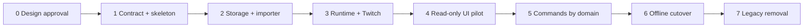

# 05. 移行とデリバリー計画

2026-09-06更新: ソースにはSQLite・候補インポーター・読み取り専用ライブ等の基盤がある。
以下のphaseは元の全体計画として残し、再実装せず追加する作業単位と現在の不足は
[11の実装順序](11-implementation-contract-and-delivery.md)を参照する。
今回の設計では実データ移行・配備・公開を実行しない。

## 1. Delivery strategy

**Status: Recommended**

Big-bang rewrite ではなく、同じ repository/image 内で v2 を育てる strangler migration を使う。
現行 production は動かしたまま、契約 test、read-only v2、new application services、SQLite、
write commands の順で境界を置き換える。

最終切替は必ず次の条件で行う。

- Twitch stream が offline。
- VOD job が running/cancelling ではない。
- source data の backup/checksum が完了。
- arm64 image と migration rehearsal が合格。
- rollback command と previous image tag が用意済み。

## 2. Migration principles

1. **Source-preserving** — 現行 JSON/JSONL を in-place 変換、削除、上書きしない。
2. **One writer per domain** — legacy と v2 が同じ entity を別実装で同時更新しない。
3. **Contract before refactor** — protected behavior を test で固定してから内部を変える。
4. **Read-only before mutation** — v2 view と migrated read model を先に検証する。
5. **Offline cutover** — current session memory を移す必要がない時点で切り替える。
6. **Rehearsable** — temp mounts と sanitized/synthetic fixtures で同じ command を繰り返す。
7. **Observable** — 各 phase は count、checksum、health、operation report を出す。
8. **Rollback is a feature** — image を戻すだけでなく data direction を定義する。

## 3. Delivery map



## 4. Phase 0 — 設計承認

### Decide

- 単一チャンネル/単一 operator。
- SQLite target。
- EventSub-first chat transport。
- information architecture と theme 方針。
- chat retention（[2026-09-06の決定](07-recording-and-workflows.md): 無期限保存・手動削除）。
- current Bot/Broadcaster identity が同一か別かを確認し、actor credential mapping を確定する。

### Deliverables

- この設計パッケージへの合意。
- Recommended decision ごとの `docs/decisions/` record。
- feature parity matrix と protected contracts の確定。
- Twitch scope inventory と development credential 手順（秘密値なし）。

### Exit gate

Open question が architecture/data model を変えない状態。

## 5. Phase 1 — 契約固定と application skeleton

### Slice 1A: characterization tests

- `/api/stream/status` live/offline/cache-only/debug/disabled/end behavior。
- current session viewer deep-copy behavior。
- automatic VOD flag、manual VOD route、OBS/secretary route absence。
- legacy config/viewer/history fixture parsing。

### Slice 1B: side-effect-free factory

- `src/twitchbot` package shell。
- `create_app()`、configuration schema、Container、Null adapters。
- runtime start/stop hook と health endpoints。
- production entrypoint はまだ legacy behavior を使える。

### Exit gate

- app import で worker/network が開始しない test。
- existing protected tests と新 characterization tests が合格。
- image、port、mount、workflow は未変更または同一結果。

## 6. Phase 2 — SQLite と importer

### Slice 2A: schema/repositories

- migrations runner、connection policy、repositories。
- temp database で unit/integration test。
- credentials separation の skeleton。

### Slice 2B: legacy importer

Command concept:

```text
twitchbot migrate inspect --source /app/data --report <path>
twitchbot migrate import --source /app/data --database <temp-db> --dry-run
twitchbot migrate verify --source /app/data --database <temp-db> --report <path>
```

実 command 名は implementation で確定するが、inspect/import/verify を分離する。

### Required report

```text
input file inventory and checksums
verified immutable source-base reference and cutoff
schema version / importer version
records read / imported / skipped / rejected
unknown keys by entity
malformed JSONL file and line number
aggregate comparisons
VOD path validation result
credentials redaction confirmation
duration and elapsed time
```

### Exit gate

- same input への rerun が duplicate を作らない。
- interrupted import は transaction rollback または resume point が明確。
- unknown keys と malformed line が silent loss にならない。
- source mtime/checksum が import 前後で一致。

## 7. Phase 3 — Runtime と Twitch adapters

### Slice 3A: Helix/Auth

- shared client、timeouts、problem mapping、rate-limit observer。
- Bot/Broadcaster actor registry、subject validation、actor別 TokenManager single-flight refresh。
- fake server/adapter contract tests。
- EventSub pilot に新 scope が必要なら、この slice で再認可手順まで用意する。credential settings UI の
  全面切替を後段にしても、期限切れ manual token のまま pilot しない。

### Slice 3B: EventSub

- connection state machine、desired subscriptions、duplicate guard。
- reconnect URL handoff、backoff、shutdown。
- normalized domain events。

### Slice 3C: Reconciler and automation runtime

- EventSub signal + periodic Helix reconciliation。
- public stream snapshot writer/clear rules。
- minute aggregator、rule scheduler、current session audience。
- EventSub cutover 前は IRC adapter を feature flag で併存可能にするが、同じ chat message を
  二重集計しない transport ownership rule を設ける。

### Exit gate

- real credential を使わない deterministic reconnect/duplicate/rate limit/token tests。
- Twitch disconnect 中も local query と VOD metadata view が機能。
- public status request call graph が local snapshot だけ。

## 8. Phase 4 — Read-only v2 UI pilot

### Route strategy

- v2 page を一時的に `/v2/*` で提供する。
- v2 API は最初から permanent `/api/v2/*` を使う。
- production navigation は明示 pilot flag が有効なときだけ v2 link を出す。
- legacy dashboard は引き続き唯一の persistent writer とする。
- persistent v2 pages は、停止中または copy mount から作った **時点固定の disposable SQLite** を読む。
  各 page に snapshot cutoff を表示し、current data だと見せない。稼働中 legacy files を反復 import
  したり tail したりしない。
- `/live` の現在状態だけは、同一 process の lock-protected legacy snapshots を読む temporary
  `LegacySnapshotAdapter` を利用できる。この adapter は detached read だけを提供し、SQLite や
  legacy globals を変更しない。

### Pages

1. App shell + global health。
2. Live offline/live/degraded states。
3. Community session は temporary live adapter、累積 viewer は cutoff snapshot。
4. Insights list/detail は cutoff snapshot。
5. Archive assets/jobs は cutoff snapshot。進捗中 job の current 表示には使わない。

### Validation

- 同じ cutoff/source manifest に対する legacy view と v2 query の stream/viewer/aggregate parity。
- page-load external API call が 0。
- keyboard/mobile/accessibility test。
- Pi で payload、LCP、CPU/memory baseline。
- v2 pilot から persistent mutation ができず、snapshot timestamp が常時見えること。

### Exit gate

固定 fixture/snapshot と temporary live adapter で、data freshness を偽装せず UI と query parity を
評価できる。日常運用の current persistent view は、該当 domain が Phase 5 で one writer へ
移行してから有効にする。

## 9. Phase 5 — Command migration by domain

一つの handoff は一 domain と direct regression coverage に限定する。domain を切り替えたら、
legacy route と v2 route の両方を同じ application command へ向ける。

Recommended order:

| Order | Domain | 理由 | Cutover proof |
|---|---|---|---|
| 1 | settings (non-secret) | local-only、外部副作用が少ない | revision/default/validation |
| 2 | presets | CRUD と Twitch update を分離できる | diff/idempotency/upstream errors |
| 3 | rules | stable ID/runtime state が重要 | reorder/state continuity |
| 4 | community | viewer ID と note migration | session/persisted merge parity |
| 5 | predictions | Twitch state conflict がある | active/resolve/cancel contract |
| 6 | VOD archive | long-running filesystem side effect | restart/cancel/path checks |
| 7 | credentials/OAuth | rollout failure impactが大きい | masked storage/refresh/scopes |

Credentials settings UI の全面移行は最後に行うが、TokenManager と必要な再認可経路は Phase 3 で
実装・検証する。
各 domain 切替後、旧実装を二重 writer として残さない。

## 10. Phase 6 — Offline persistence/UI cutover

### Preflight

```text
[ ] stream offline and public snapshot null
[ ] Bot disabled / EventSub stopped cleanly
[ ] no queued/running/cancelling archive job
[ ] free space sufficient for DB + backup + report
[ ] source inventory/checksum saved
[ ] previous image digest recorded
[ ] candidate arm64 image smoke-tested
[ ] dry-run/import/verify completed against copied mount
[ ] rollback export rehearsed
[ ] Bot/Broadcaster credential subjects and required scopes validated
```

### Cutover sequence

1. Portainer で current container を停止し、source `/app/data` を backup する。
2. Candidate image の one-shot migration を source-preserving mode で実行する。
3. Verification report の P0 count/aggregate/path checks を確認する。
4. v2 runtime を起動し、DB schema/readiness/status offline contract を確認する。
5. `/` を `/live` へ向け、v2 writes を有効にする。
6. synthetic/test adapters または safe local actions で settings/rules read-write smoke を行う。
7. 次回実配信で live transition、EventSub、automation、session、end、history、VOD gate を監視する。

実際の production backup/migration/deploy は別の明示承認 scope とし、この設計作業では行わない。

### Success window

少なくとも次を観測するまで legacy code/data を削除しない。

- offline startup/restart 1 回。
- full live start → live operation → end cycle 1 回。
- EventSub reconnect または controlled reconnect test 1 回。
- manual VOD job 1 回。自動 VOD は設定が off のままなら実行しない。
- backup と DB integrity check 1 回。

## 11. Rollback

### Before v2 writes

- Candidate container を停止。
- previous image digest を起動。
- untouched legacy JSON/JSONL を使用。

### After v2 writes

単純に old image を起動すると cutover 後の変更を失う。次のどちらかを選ぶ。

1. 変更を破棄してもよい短い pilot window なら、時点と失われる operation を明示して
   untouched backup へ戻す。
2. 変更を保持するなら、停止中 DB から **新しい staging directory** へ legacy export し、
   verify report 合格後に explicit file swap を行う。

Rollback exporter requirements:

- source DB を変更しない。
- verified immutable source base を staging へ copy し、manifest/checksum を再確認する。
- `config.json`, `viewers.json`, `history/stream_index.json` は source base の unknown keys を保ったまま
  current known fields を merge する。
- pre-cutover JSONL は byte-for-byte copy し、post-cutover stream だけ canonical JSONL を生成する。
- legacy config の credential field は専用の secret-aware step で扱い、staging file を `0600` にする。
  verified base 値を使うか再認可するかを明示し、report/標準出力へ値を出さない。
- unsupported new field を report する。
- VOD file を move/delete しない。
- final target を resolved absolute path で検証してから swap する。
- source base がない、checksum が違う、actor credential mapping が未解決なら停止する。

## 12. Phase 7 — Legacy removal

Removal gate:

- success window 完了。
- legacy endpoint usage が status endpoint を除き 0。
- parity matrix 全項目 pass。
- rollback artifact と migration docs が保管済み。
- active handoff/review が完了。

Remove:

- legacy dashboard templates/CSS/inline JS。
- legacy form route adapters（明示互換対象を除く）。
- IRC adapter（EventSub chat の full-cycle 実績後）。
- JSON write repositories。
- pilot `/v2` prefix/flag。

Keep:

- legacy importer/exporter と migration fixtures。
- `/api/stream/status` compatibility tests/route。
- prior image tags と migration report retention policy。
- VOD files と original backup（retention 決定まで）。

## 13. Feature parity matrix

| Capability | Legacy evidence | v2 acceptance |
|---|---|---|
| Live status | `/api/status`, `/api/stream/status` | actual snapshot、freshness、compat exact |
| Bot lifecycle | toggle + worker threads | explicit states、idempotent start/stop、health |
| Session viewers | dashboard polling | detached snapshot、duration/visit parity |
| Viewer records | memo/history/followers/SO | stable ID、note、sync、shoutout result |
| Presets | create/edit/delete/apply | same data + diff/idempotency |
| X announcement | preset social tags + X intent | cached state から preview/intent、no auto-post |
| Rules | game/interval/comments/order | stable rule ID + wait reason |
| Predictions | preset/start/resolve/cancel | Twitch conflict/scopes surfaced |
| Activity | events/logs | normalized timeline + retention |
| Analytics | list/calendar/trends/detail | source/completeness + metric parity |
| VOD | sync/manual/bulk/progress/cancel/delete/auto | job state machine + path safety |
| Settings | credentials/Bot/layout/debug | separated settings/secrets、typed defaults |
| External status | cached read-only JSON | no request-time external call forever |

Feature parity は同じ visual layout を意味しない。利用者が達成する task と protected behavior が
同等以上であることを意味する。

## 14. Risk register

| Risk | Likelihood/impact | Mitigation | Proof |
|---|---|---|---|
| unknown legacy fields lost | M/H | inspect/report + entity extras + immutable source base | fixture/rehearsal diff |
| pilot SQLite becomes stale | H/M | cutoff表示 + fixed snapshot + live snapshot adapter only | no-mutation/freshness tests |
| EventSub lost/duplicate events | H/H | dedupe + Helix reconciliation | disconnect/duplicate tests |
| token refresh races/cross-actor overwrite | M/H | actor別 single-flight TokenManager | concurrent 401/subject test |
| runtime starts twice | M/H | side-effect-free factory + gunicorn hook | lifecycle test |
| SQLite lock contention | M/M | short tx、per-thread connection、bounded queue | load/fault test |
| Pi UI/runtime regression | M/M | budgets + arm64 smoke + real-device profiling | pilot report |
| VOD path escapes mount | L/H | resolved relative path allowlist | traversal/symlink tests |
| rollback loses new writes | M/H | explicit export/rehearsal/success window | rollback drill |
| missing Twitch scope disables features | M/M | feature-level readiness | scope matrix tests |
| old/new writers diverge | M/H | application command convergence、one writer | route contract tests |

## 15. Handoff slicing rules

実装時は project policy に従い、一つの handoff に次を明記する。

- one goal and behavior boundary。
- files to inspect/edit。
- acceptance criteria と non-goals。
- real Twitch/data/media/deployment を使わない verification。
- current protected contracts。
- stable self-review 後の independent review risk。

次を一つの handoff にまとめない。

- EventSub discovery と全 UI 実装。
- schema design、production migration、deployment。
- VOD state machine と unrelated analytics redesign。
- OAuth choice が未解決なまま credential UI 実装。

## 16. Overall Definition of Done

- [ ] Must scope の feature parity matrix がすべて合格。
- [ ] `/api/stream/status`、snapshot clear/copy/debug、VOD auto-default の P0 contract が合格。
- [ ] source-preserving migration と rollback rehearsal が sanitized copy で合格。
- [ ] unit/contract/integration/browser/arm64 checks が合格。
- [ ] UI の主要 state と accessibility acceptance が合格。
- [ ] secret/runtime data/media/deployment boundary が保たれている。
- [ ] full stream lifecycle pilot が合格。
- [ ] completed handoffs と decisions が project lifecycle rule に従い archive 済み。
- [ ] legacy removal 前に explicit approval がある。
