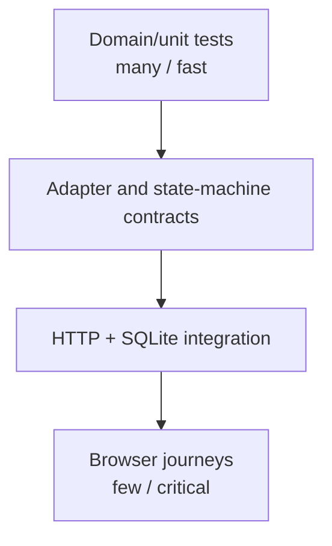
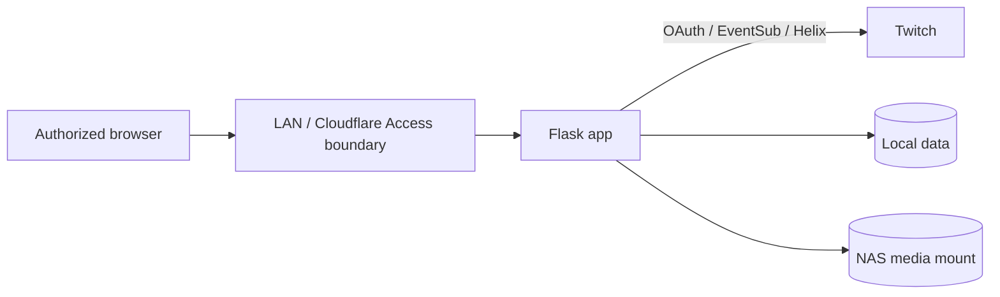

# 06. 品質・セキュリティ・運用設計

## 1. Quality strategy

品質目標は coverage 数字ではなく、運用上失ってはいけない契約と failure recovery を
自動検証できることとする。test は real Twitch、real credentials、production data、VOD media、
secretary-bot、OBS、他の外部 service に接続しない。

## 2. Risk levels

| Level | 例 | Merge/release gate |
|---|---|---|
| P0 | public status、stream clear、token、data migration、path delete、自動VOD | deterministic regression + reviewer |
| P1 | EventSub、rules、prediction、viewer aggregation、VOD jobs | unit + integration + fault test |
| P2 | analytics query、settings、UI forms | route + browser test |
| P3 | cosmetic styling、copy | visual/a11y review |

Coverage target は補助指標とし、P0/P1 の state transition と error branch を優先する。

## 3. Test layers



### 3.1 Unit

- domain state machine、validation、mapping、aggregation、filename/path policy。
- fake clock と in-memory/fake repository。
- thread、Flask、network、subprocess を使わない。

### 3.2 Contract

- Twitch adapter request/response mapping。
- EventSub envelopes、reconnect、duplicate、unknown version。
- VOD downloader progress/cancel/error callback。
- public/legacy/v2 JSON response schema。
- migration input/output fixture。

### 3.3 Integration

- Flask test client + temporary SQLite + temporary mount directories。
- application command → repository → read model の transaction。
- runtime supervisor と thread stop/join。
- external adapter は recorder/fake server で置換し、real DNS を禁止する。

### 3.4 Browser

- isolated app instance と synthetic data を使う。
- desktop、tablet、mobile viewport。
- keyboard journeys、focus、dialog、sort、validation、poll recovery。
- automated accessibility scan と manual semantic review。
- light/dark、200% zoom、reduced motion。

Playwright 等を採用する場合は development/CI-only dependency とし、production image の runtime
dependency を増やさない。使用 tool は最初の browser-test handoff で一つに決める。

### 3.5 Container/arm64

- multi-architecture build。
- `linux/arm64` container 内で Python import、schema migration、focused pytest。
- ffmpeg と yt-dlp executable/import smoke。
- gunicorn port `8501`、non-root UID/GID、mount read/write/restart persistence。
- `docker compose config` と health endpoint。

## 4. Protected behavior suite

現行 test が守っている次の契約を v2 の最初から維持する。

### P0 stream status

- offline/live JSON shape。
- detached current stream snapshot。
- request-time Twitch call 0。
- request-time secretary/OBS/external call 0。
- end/disabled で snapshot clear。
- `ignore_stream_status` の synthetic/debug live を非公開。
- `checked_at` は UTC response time。

### P0 current session

- viewer dictionary の lock-protected snapshot。
- nested value まで detached。
- API 表示用 field 追加が shared memory を変更しない。
- stream end で session state を確定・clear。

### P0 VOD

- automatic download は `enable_vod_download` だけで gate。
- default false。
- manual/bulk/cancel/delete/sync が OBS/admin mode に依存しない。
- removed secretary/OBS/migration routes は 404。
- stream ID と resolved path が mount 内。

### P1 rules and paths

- reorder/edit 後も runtime state が正しい stable rule に残る。
- history index と files は configured `/app/data/history` を使う。
- `/app/downloads` 以外を media operation の対象にしない。

## 5. v2 test catalogue

### 5.1 EventSub

- welcome → subscriptions → active。
- welcome timeout。
- keepalive timeout。
- server-provided reconnect URL へ handoff。
- abrupt disconnect → backoff → resubscribe。
- duplicate message ID は一回だけ apply。
- out-of-order/stale timestamp policy。
- malformed JSON/unknown message type を quarantine して継続。
- bounded queue full 時の health/degraded/reconciliation。
- shutdown 中に reconnect しない。

### 5.2 Helix/Auth

- timeout、connection error、4xx、5xx、malformed JSON。
- pagination cap と cursor loop guard。
- rate-limit headers、429 reset time。
- Bot/Broadcaster subject が設定 ID と一致し、不一致は action-required になる。
- actor が同じ場合の credential 共有と、異なる場合の完全分離。
- concurrent 401 が該当 actor について refresh 1 回になり、他 actor を更新しない。
- rotated refresh token を正しい actor record に保存する。
- operation → actor → missing scope を feature-level problem に変換する。
- token/header/body が log/exception response に出ない。

### 5.3 Stream reconciliation

- EventSub online + Helix metadata publish。
- EventSub offline clear。
- missed offline event を consecutive poll で clear。
- temporary offline response は existing grace policy に従う。
- stream ID change は previous session finalize → new session start。
- Bot disabled clear、enable 後は fresh observation まで offline。
- debug state と public state writer の分離。

### 5.4 Automation

- game `All` / `Default` / specific precedence。
- interval、minimum comment、disabled、invalid rule。
- monotonic clock crossing、restart recovery。
- reorder/edit/delete と runtime foreign key。
- chat send rate limit、send failure、retry/no-retry classification。
- same evaluation から二重 message を送らない。

### 5.5 Predictions

- preset validation、outcome length/count、duration bounds。
- active prediction conflict。
- create success/local commit failure reconciliation。
- resolve/cancel allowed transitions、unknown outcome。
- Affiliate/Partner/scope error display。

### 5.6 Viewers/events/analytics

- repeated sightings と visit/streak/duration aggregation。
- display name/login change、stable user ID。
- follow/unfollow/sub/gift/Bits/raid/points mapping。
- minute bucket swap 中の incoming event。
- missing samples と true zero の区別。
- UTC/JST boundary、daylight saving を仮定しない表示。
- large query の pagination/sort/filter allowlist。
- chat retention boundary。

### 5.7 VOD/media

- manual/bulk/automatic trigger label。
- queued/running/cancelling/cancelled/succeeded/failed transitions。
- restart 時 dangling job recovery。
- yt-dlp unavailable、ffmpeg unavailable、network failure、no URL。
- cancellation before start/during download/after completion race。
- progress callback の malformed/unknown values。
- traversal、absolute path、symlink escape、unexpected extension。
- delete missing file は idempotent result、unrelated file は untouched。
- bulk concurrency limit と disk-space warning。

### 5.8 Persistence/migration

- empty/missing/malformed config/viewer/index。
- JSONL bad line を report し valid line を継続。
- unknown fields retained/reported。
- rerun idempotency、partial transaction rollback。
- aggregate/count/checksum comparison。
- SQLite busy/corrupt/schema-too-new handling。
- source files and timestamps unchanged。
- VOD absolute-to-relative path conversion and rejection。
- rollback は pre-cutover JSONL の byte一致、post-cutover canonical JSONL の schema/entity/aggregate
  一致、config/viewers/index known fields の semantic 一致を分けて検証する。
- immutable source base 欠落/checksum 不一致で exporter が fail closed する。

### 5.9 Web/API

- schema/content type/size/length/range validation。
- CSRF、Origin、method semantics。
- revision conflict、Idempotency-Key reuse/conflict。
- problem response secret redaction。
- ETag/304、cursor expiry/invalid cursor。
- hidden tab polling stops/backs off and resumes。
- duplicate submit disabled and result persists outside toast。
- X 告知文の encoding、cached title/social tags、明示 click だけで intent を開くこと。server が
  X へ接続せず、自動投稿を成功扱いしないこと。

## 6. Test isolation contract

```text
Clock              FakeClock
Twitch HTTP        FakeHelix / local recorder transport
EventSub WebSocket ScriptedEventSubTransport
Downloader         FakeDownloader
Filesystem         per-test temporary directory
Database           per-test temporary SQLite
Credentials        placeholder actor registry, never environment discovery
Threads            explicit start/stop, bounded join
DNS/network        denied by default
```

monkeypatch を module global のあちこちへ当てるのではなく、Container で adapter を差し替える。
requests/session、socket/SSL、yt-dlp/ffmpeg が real boundary に到達した場合 test を fail させる。

## 7. Performance verification

### Budgets

[01-product-requirements.md](01-product-requirements.md) の暫定 budget を、synthetic small/medium/large
fixture と Raspberry Pi 実機で測定して確定する。

| Scenario | Measure |
|---|---|
| `/api/v2/live` polling | p50/p95 latency、payload、DB queries |
| 10k viewers search/sort | latency、peak memory、query plan |
| 1 year streams/samples | list/detail/chart query latency |
| 100 events/min ingestion | queue depth、flush latency、lost/duplicate |
| VOD running + dashboard | HTTP latency、CPU/memory、disk I/O |
| EventSub reconnect storm | retry rate、thread count、health transition |

### Rules

- `EXPLAIN QUERY PLAN` で list/filter query の full scan を確認する。
- chart endpoint は display pixel より過剰な samples を返さず downsample する。
- expensive analytics は request ごとに全 JSONL を読み直さない。
- Browser asset は project-local、versioned、cacheable。page ごとの JavaScript budget を測る。
- performance regression threshold は baseline 確定後に test/CI へ入れる。

## 8. Security model

### Trust boundaries



外部 identity/authentication は既存の LAN/Cloudflare Access 境界に残す。v2 は team user database や
新しい public login を導入しない。ただし edge auth だけを理由に application-level input/CSRF/
secret/path protection を省略しない。

### Threats and controls

| Threat | Control |
|---|---|
| CSRF on mutation | random session CSRF token、same-origin check、SameSite cookie |
| XSS from title/chat/viewer/memo | Jinja autoescape、`textContent`、CSP、no inline handlers |
| credential leakage | separate store、masked UI、redaction、no export/API value |
| malicious/oversized input | content-length、schema、text/list bounds、allowlists |
| path traversal/symlink | resolved mount containment、no user absolute path、pre-delete recheck |
| shell injection | subprocess argv、no shell、validated executable/options |
| SSRF | fixed Twitch endpoints、thumbnail URL not server-fetched by arbitrary input |
| replay/double action | EventSub message ID、Idempotency-Key、state machine |
| stale writes | resource revision/If-Match |
| host header/proxy spoofing | configured trusted hosts/proxies only |
| dependency/CDN compromise | pinned production dependencies、local browser assets、image scan |
| log privacy | structured allowlisted fields、bounded retention、no raw chat by default logs |

### HTTP baseline

- CORS disabled unless a named consumer and origin is explicitly approved。
- CSP without inline scripts; static self, Twitch image origins only where needed。
- `X-Content-Type-Options: nosniff`、frame policy、referrer policy。
- secure cookie attributes when served over HTTPS; local HTTP behavior documented。
- state-changing operation は GET で実装しない。
- error page/JSON に stack trace を出さない。

### Credential store

- preferred: Docker secret/environment supplied at runtime。
- dashboard persistence が必要な場合: dedicated file、Linux mode `0600`、atomic replace。
- API は actor、subject ID、presence、expiry、scopes、last validation だけを返す。
- Bot/Broadcaster が別 ID なら record/refresh lock を分け、同一 ID なら明示 reference で共有する。
- token refresh は正しい actor の rotated access/refresh pair を失わない write protocol を持つ。
- backup/export は credentials を既定で除外し、再認可手順を用意する。

Application-level encryption は key を同じ filesystem に置くだけなら脅威を減らさないため、
目的と key management が決まるまで「暗号化済み」と見せかけない。

## 9. Privacy and retention

Viewer records、memo、chat、follow/sub/Bits は個人に関係する data として扱う。

- UI と API の list は必要 field だけを返す。
- operational log に memo/chat 本文を複製しない。
- export は対象、期間、含まれる private data を確認する。
- delete/retention job は dry-run report と backup policy を持つ。
- チャット本文は[2026-09-06の決定](07-recording-and-workflows.md)に従い無期限保存・手動削除。
  source migration で silent deletion しない。
- screenshot/fixture/docs に実 user data を使わない。

## 10. Observability

### Structured application logs

```text
timestamp, level, component, event_code, message,
request_id, operation_id, stream_id, job_id,
duration_ms, retry_at
```

viewer name、chat body、memo、token、authorization header、raw upstream payload、absolute private path を
default log field にしない。exception は safe classification と internal stack を分け、UI には
request/operation ID だけを返す。

### Health signals

| Component | Signals |
|---|---|
| EventSub | state、session age、last message、reconnect count |
| Helix | last success/error、rate-limit remaining/reset |
| Credentials | actor別 subject、valid/action required、expiry、scope gaps |
| Reconciler | last check、snapshot freshness |
| Automation | last evaluation/send/error、queue delay |
| Metrics | current bucket、last flush、dropped events |
| Archive | active/queued jobs、last result |
| SQLite | schema、last write、busy/error count |

Prometheus 等の新 service は初期範囲外。health read model、structured stdout logs、operation log で
運用し、不足が確認された場合に追加する。

### Alert presentation

- `info`: operation history に残す。
- `warning`: UI alert center、feature は継続。
- `action_required`: global header count と修復 link。
- `critical`: data write/path/runtime safety に関わり、該当 writer を停止。

external notification integration はこの project の初期範囲に含めない。

## 11. Backup and recovery

### Database

- NAS保存、配信終了後＋1日1回の頻度は2026-09-06に決定。
  [08の設計](08-nas-backup-and-settings.md)で、作成・転送・検証・復元の具体案を扱う。
- pre-migration/pre-upgrade backup は必須。
- runtime backup は SQLite backup API と bounded rotation を使う。
- `PRAGMA quick_check` を定期/upgrade 前に実行する。
- backup success は一貫したsnapshotとdestinationのintegrity/schema/countを確認する。
  稼働中に変化するsource DBの現在件数との単純一致は要求しない。

### Credentials

- automatic application backup から除外。
- restore は re-authorization を第一手段にする。

### Media

- `/app/downloads` media backup/retention は別の storage operation とし、この app が recursive copy や
  archive move を行わない。
- DB backup は media file の存在を保証しないため、asset verification state を持つ。

### Recovery drills

- corrupt candidate DB から latest verified backup を temp path へ restore。
- interrupted migration rollback。
- interrupted VOD job recovery。
- expired token から re-authorization。
- previous image + legacy export への rollback。

## 12. Deployment and release gates

既存 GitHub Actions → GHCR multi-architecture image → Portainer manual deployment の flow を維持する。
auto-deploy は追加しない。

### Pull request gate

- focused unit/contract/integration tests。
- Python syntax/type/lint check（tool は別 decision で固定）。
- `git diff --check`。
- dependency/license/security scan when dependencies change。
- template/static change は isolated browser check。
- protected behavior search/contract check。

### Main/image gate

- full test suite。
- `linux/amd64` + `linux/arm64` build。
- arm64 import/migration smoke。
- image runs non-root and liveness passes。
- no credentials/runtime data/media in build context/layers。

### Portainer preflight

- explicit SHA image tag/digest を記録。
- backup/migration version/rollback target を記録。
- mounts、UID/GID、host network、port `8501` を確認。
- real data migration は別承認・offline window。

## 13. Current verification gaps to close first

2026-08-13 の現行 test は stream status、worker snapshot、session viewer、VOD route、rule reset、
path に集中している。v2 着手前に少なくとも次を characterization する。

- Twitch API error/pagination/auth header boundary。
- IRC parse/reconnect/event aggregation（移行完了まで）。
- yt-dlp/ffmpeg failure/cancel/progress/bulk concurrency。
- presets/rules/predictions/viewers/settings CRUD validation。
- worker lifecycle start/stop/race。
- malformed config/history と migration fixtures。
- main browser journeys と accessibility semantics。

現行環境で `pytest` が利用できない場合は dependency を勝手に追加せず、container または承認済み
development environment で実行し、blocked check を明記する。

## 14. Release readiness checklist

```text
[ ] P0/P1 contracts pass
[ ] no real external calls in tests
[ ] migration + rollback rehearsal pass
[ ] credentials redaction scan pass
[ ] Bot/Broadcaster subject/scope routing pass
[ ] arm64 image smoke pass
[ ] UI state/a11y/browser checks pass
[ ] performance budgets pass or approved variance exists
[ ] DB integrity/backup/restore check pass
[ ] stream lifecycle pilot pass
[ ] VOD manual job and auto-off proof pass
[ ] public status consumer compatibility pass
[ ] deployment and external exposure unchanged
```
