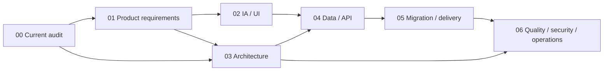

# Twitch Bot v2 再構築設計

## この資料の位置づけ

このディレクトリは、現行の Twitch Bot を運用しながら次世代版（以下 v2）を
一から再構築するための設計パッケージである。2026-08-13 時点のコード、テスト、
既存ドキュメント、Twitch 公式仕様を基準にしている。

00〜11は設計・推奨案、12以降は実装と検証の到達点を記録する。
実装済みの基盤と将来要件を区別する。本番切替は[19](19-production-cutover.md)に記録する。`Recommended` と `Open` の項目は、
実装着手前に承認または変更する。

2026-09-06の設計対話で合意した機能優先順位、主要4画面、保存方針と、
具体化中の運用案は[07-recording-and-workflows.md](07-recording-and-workflows.md)に記録する。
同資料の`Accepted`と、未決定の詳細案を区別して参照する。
NASバックアップと設定・復元の詳細は[08-nas-backup-and-settings.md](08-nas-backup-and-settings.md)を参照する。
将来用の自動投稿・チャットコマンド・予想の詳細案は[09-automation-commands-and-predictions.md](09-automation-commands-and-predictions.md)を参照する。
同接・欠測の計算契約は[10](10-viewer-metrics-and-data-quality.md)、ソースの到達点・データ/APIの追加・
実装順序は[11](11-implementation-contract-and-delivery.md)にまとめる。
同接・欠測と履歴読み取りの初期実装、接続境界、検証範囲は[12](12-analytics-implementation.md)を参照する。
コミュニティ・配信中の操作・バックアップ基盤の初期実装は[13](13-community-controls-and-backups.md)を参照する。
arm64・実NAS・ブラウザでの初回検証結果と修正は[14](14-device-verification.md)を参照する。
記録ワーカー・NAS自動保存・自動化・予想の接続と再検証は[15](15-runtime-and-connections.md)、
新版の明示的な起動と切替前提は[16](16-cutover-readiness.md)を参照する。
Twitchログイン画面・自動認証更新・初回設定は[17](17-twitch-authorization.md)を参照する。
旧画面との統合と実データの移行照合は[18](18-integrated-host-and-migration-rehearsal.md)を参照する。
新Botへの本番切替、検証結果、保留項目、復旧方針は[19](19-production-cutover.md)を参照する。

## 結論

v2 は、既存機能を単純に移植した SPA ではなく、次の方針で作る。

1. 配信中の判断と操作を最短にするタスク指向 UI に再編する。
2. Flask のモジュラーモノリスと単一コンテナを維持し、責務境界を作り直す。
3. Twitch EventSub と Helix API を中心にし、IRC 依存を段階的に解消する。
4. 運用データは SQLite、秘密情報は分離ストア、VOD 本体は
   `/app/downloads` のまま管理する。
5. 現行 JSON/JSONL は上書きせず、検証可能なインポートと段階切替で移行する。
6. `GET /api/stream/status` のキャッシュ限定・read-only 契約を永久互換面として残す。

## 設計資料

| 資料 | 決めること |
|---|---|
| [00-current-state-audit.md](00-current-state-audit.md) | 現行機能、強み、課題、改善優先度 |
| [01-product-requirements.md](01-product-requirements.md) | 目的、利用者、スコープ、要件、成功指標 |
| [02-information-architecture-and-ui.md](02-information-architecture-and-ui.md) | 情報設計、画面、操作フロー、デザインシステム |
| [03-system-architecture.md](03-system-architecture.md) | 技術選定、モジュール、Twitch 接続、バックグラウンド処理 |
| [04-data-and-api.md](04-data-and-api.md) | データモデル、保存境界、API 契約、互換性 |
| [05-migration-and-delivery.md](05-migration-and-delivery.md) | 段階移行、リリース単位、ロールバック、Definition of Done |
| [06-quality-security-operations.md](06-quality-security-operations.md) | テスト、性能、セキュリティ、可観測性、運用 |
| [07-recording-and-workflows.md](07-recording-and-workflows.md) | 今回の合意事項、日常操作、記録・保存・復旧の具体案 |
| [08-nas-backup-and-settings.md](08-nas-backup-and-settings.md) | NASバックアップ、世代管理、設定・復元の具体案 |
| [09-automation-commands-and-predictions.md](09-automation-commands-and-predictions.md) | 初期無効の自動投稿・コマンド・予想、実行条件と操作の具体案 |
| [10-viewer-metrics-and-data-quality.md](10-viewer-metrics-and-data-quality.md) | 同接の取得、時間加重平均、最大、欠測、記録品質と比較 |
| [11-implementation-contract-and-delivery.md](11-implementation-contract-and-delivery.md) | 既存基盤と不足、追加モデル/API、実装単位と完了条件 |
| [12-analytics-implementation.md](12-analytics-implementation.md) | 同接と履歴の初期実装・読み取りAPI・隔離検証・未接続の範囲 |
| [13-community-controls-and-backups.md](13-community-controls-and-backups.md) | イベント・フォロー・チャット、メモ・セット、バックアップ・復元候補の初期実装 |
| [14-device-verification.md](14-device-verification.md) | arm64・NAS・実ブラウザの検証結果、時計差修正、実環境統合の残り |
| [15-runtime-and-connections.md](15-runtime-and-connections.md) | 記録・NAS自動保存・自動化・予想の接続と実機再検証 |
| [16-cutover-readiness.md](16-cutover-readiness.md) | 明示的な新版起動、移行候補、切替・復旧の前提 |

## 意思決定の状態

| 状態 | 意味 |
|---|---|
| `Locked` | 現行プロジェクトの耐久ルール。v2 でも変更しない |
| `Recommended` | この設計パッケージの推奨。実装開始時に決定記録へ昇格する |
| `Open` | 利用者の選択または短い技術検証が必要 |

## Locked: 変更しない境界

- Twitch 配信用 Bot と管理ダッシュボードであり続ける。
- Raspberry Pi と `linux/arm64` を第一ターゲットとする。
- 単一 Docker コンテナ、gunicorn、ホストネットワーク、ポート `8501`、
  `/app/data` と `/app/downloads` のマウント境界を維持する。
- GHCR へのマルチアーキテクチャ image publish と、Portainer での手動配備を維持する。
- `GET /api/stream/status` はワーカーが既に保持する実際の Twitch 状態だけを返す。
  リクエスト中に Twitch API や外部サービスを呼ばない。
- externally visible な配信スナップショットは配信終了または Bot 無効時に消去する。
- secretary-bot 通知、OBS 制御・状態・設定、VOD-to-OBS 移行を導入しない。
- Twitch VOD ダウンロードは独立機能として維持し、自動取得は
  `enable_vod_download` のみで制御し、初期値を無効のままにする。
- 認証情報、現行 runtime data、視聴者/履歴データ、メディアを設計・テストで使用しない。

## Recommended: v2 の基本構成

| 領域 | 推奨 |
|---|---|
| Backend | Python 3.12 / Flask 3 / app factory / 型付きサービス境界 |
| UI | Jinja2 shell + Vanilla JavaScript ES modules + project-local CSS |
| Runtime | gunicorn 1 worker + threads、明示的な runtime supervisor |
| Twitch | EventSub WebSocket（受信）+ Helix API（コマンド） |
| Persistence | Python 標準 `sqlite3` + migration runner |
| Realtime UI | 集約 snapshot API の適応的 polling。SSE/WebSocket は初期範囲外 |
| Charts | バージョン固定した project-local chart asset |
| Tests | pytest、fake Twitch adapters、契約テスト、ブラウザ E2E |

この構成は React/FastAPI/Redis 等を否定するものではない。単一利用者・単一チャンネル、
Raspberry Pi、単一コンテナという現実の運用に対して、追加ランタイムと分散状態を
持ち込まずに十分な分離と UI 品質を得る選択である。

## UI concept preview

`/live` の優先順位と responsive behavior を具体化した会話内 preview は、この設計パッケージとは
別の一時 artifact として作成している。repository へ UI implementation や generated image を追加した
わけではない。実装開始時は [02-information-architecture-and-ui.md](02-information-architecture-and-ui.md)
を、[今回合意した画面の基本構成](07-recording-and-workflows.md)と整合させ、
offline/live/degraded の browser prototype を project 内で改めて作る。

## 設計の読み方

## 実装と外部接続に向けた確認事項

1. UIの基本構成は07・09のAcceptedを採用する。アーカイブ機能は補助導線から維持する。
2. SQLite基盤と候補インポーターを再利用し、現行JSON/JSONLは変更せず移行元として残す。
3. 新規チャット受信はEventSub中心の推奨を維持し、IRC併存中の収集担当を一意にする。
4. 読み取りと隔離した操作検証から段階的に切り替え、既存の公開ステータスを維持する。
5. Botと配信者の実アカウント・認可、NAS転送、実データ切替の条件は接続・移行前に確認する。

未確認の実環境情報を使わず進められる作業と実環境での検証は[11](11-implementation-contract-and-delivery.md)で分ける。
詳細の推奨値ごとに追加質問を重ねず、設計・隔離検証を進める。実移行・デプロイ・公開の範囲は別途具体化する。

## 現行監査の主な根拠

- 機能と運用: [`README.md`](../../README.md)
- 起動とワーカー: [`app.py`](../../app.py)、[`services/workers.py`](../../services/workers.py)
- 共有状態と JSON: [`config.py`](../../config.py)、[`services/storage.py`](../../services/storage.py)
- 画面と API: [`routes/`](../../routes)、[`templates/`](../../templates)、[`static/`](../../static)
- 保護挙動: [`tests/test_stream_status.py`](../../tests/test_stream_status.py)、
  [`tests/test_workers_snapshot.py`](../../tests/test_workers_snapshot.py)
- 現行の改善候補: [`docs/improvements.md`](../improvements.md)

## 外部仕様の一次資料

- [Twitch Chat & Chatbots](https://dev.twitch.tv/docs/chat/)
- [Authenticating and Setting up EventSub](https://dev.twitch.tv/docs/chat/authenticating/)
- [IRC migration guide](https://dev.twitch.tv/docs/chat/irc-migration/)
- [EventSub](https://dev.twitch.tv/docs/eventsub/)
- [EventSub WebSocket handling](https://dev.twitch.tv/docs/eventsub/handling-websocket-events/)
- [Twitch Authentication](https://dev.twitch.tv/docs/authentication/)
- [Refreshing access tokens](https://dev.twitch.tv/docs/authentication/refresh-tokens/)
- [Twitch API guide / rate limits](https://dev.twitch.tv/docs/api/guide/)
- [Twitch API reference](https://dev.twitch.tv/docs/api/reference)
